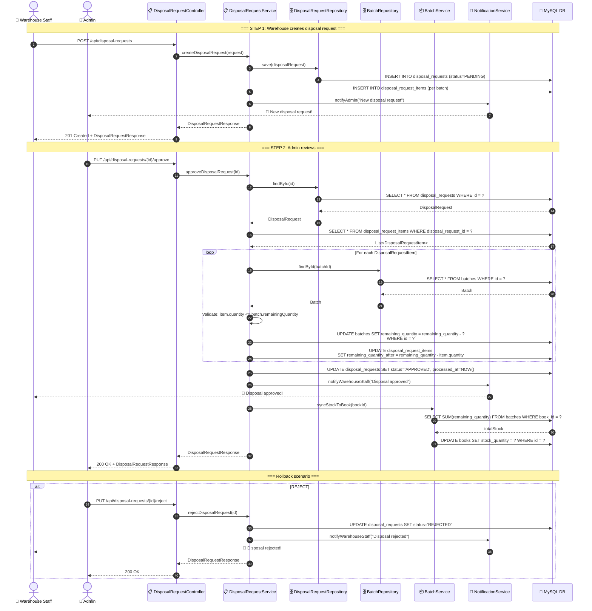
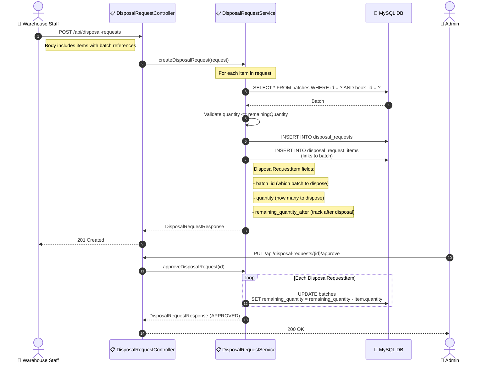

# SEQ-008: Disposal Request Flow

> **Sequence ID:** SEQ-008
> **Maps to:** UC-007
> **Phiên bản:** 1.0.0
> **Ngày:** 2026-04-25

---

## Disposal Request Full Flow

---

## Disposal with Batch Linking

---

*Generated by Senior BA Agent | BookStore Backend | 2026-04-25*
