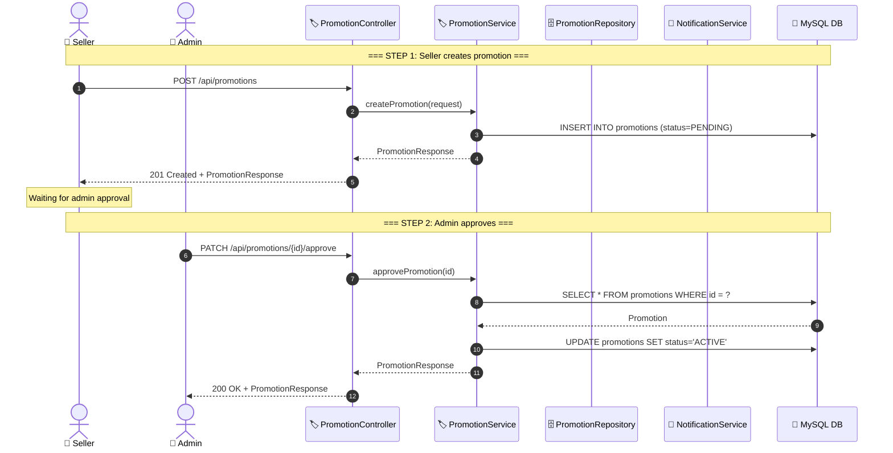
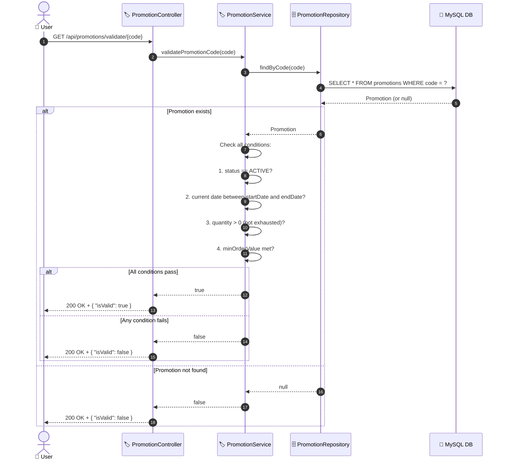
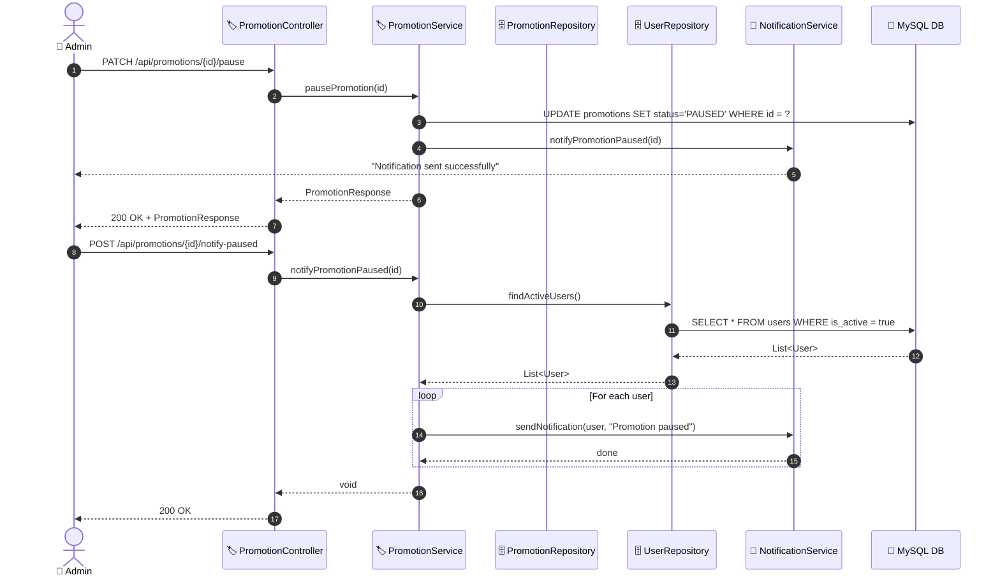
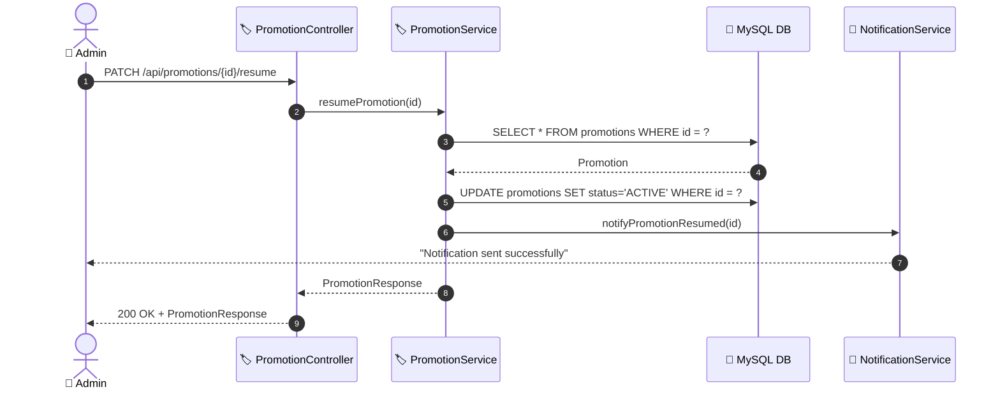

# SEQ-009: Promotion Management

> **Sequence ID:** SEQ-009
> **Maps to:** UC-008
> **Phiên bản:** 1.0.0
> **Ngày:** 2026-04-25

---

## Create & Approve Promotion

---

## Validate Promotion Code (At Checkout)

---

## Pause & Notify Customers

---

## Resume Promotion

---

*Generated by Senior BA Agent | BookStore Backend | 2026-04-25*
