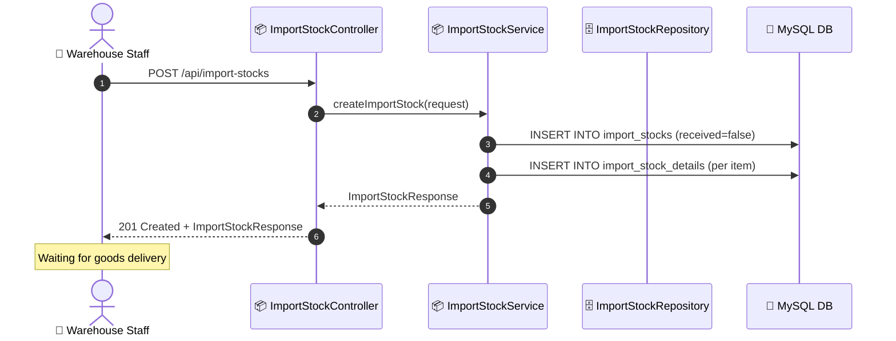
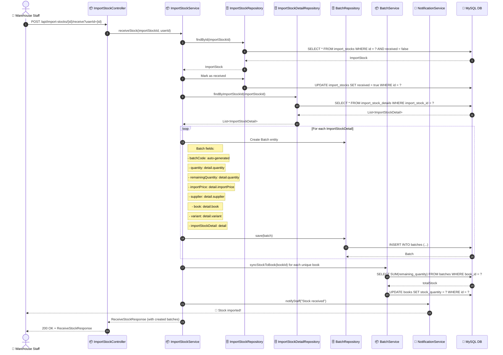
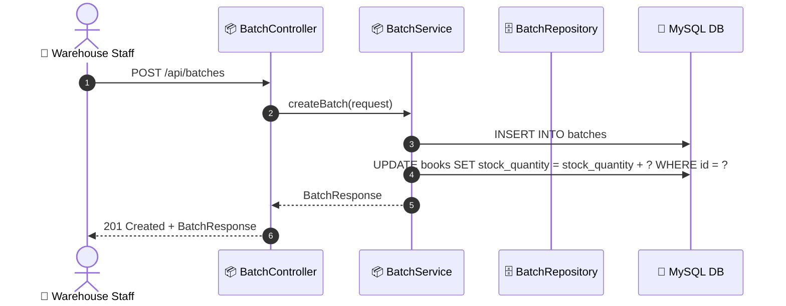
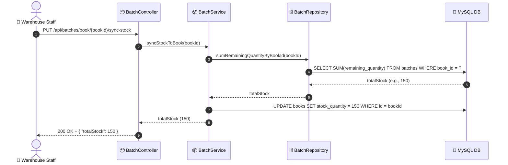
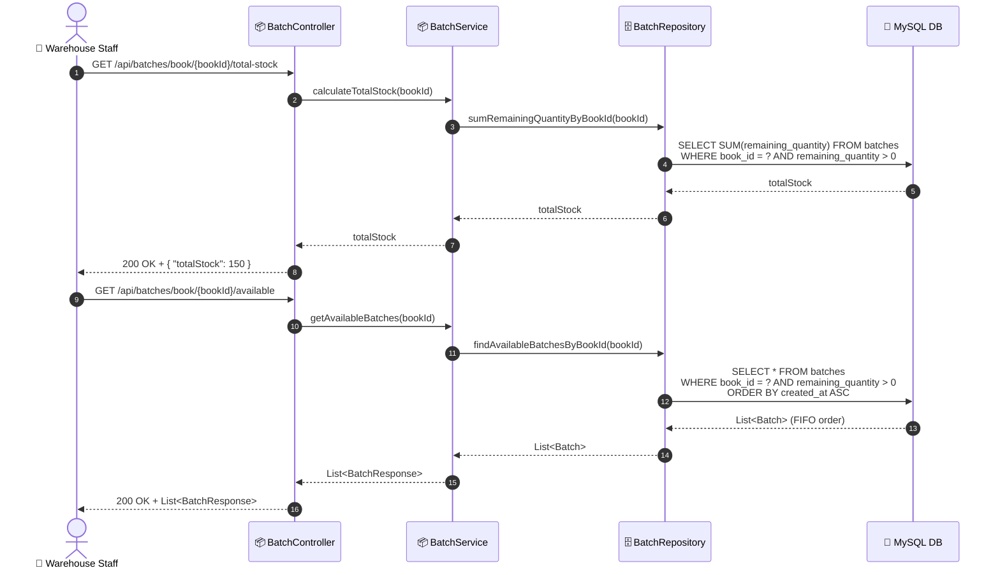

# SEQ-010: Import Stock & Batch

> **Sequence ID:** SEQ-010
> **Maps to:** UC-010
> **Phiên bản:** 1.0.0
> **Ngày:** 2026-04-25

---

## Create Import Stock

---

## Receive Stock (Create Batch)

---

## Manual Batch Creation (No PO)

---

## Sync Stock to Book

---

## Calculate Total Stock (FIFO View)

---

*Generated by Senior BA Agent | BookStore Backend | 2026-04-25*
