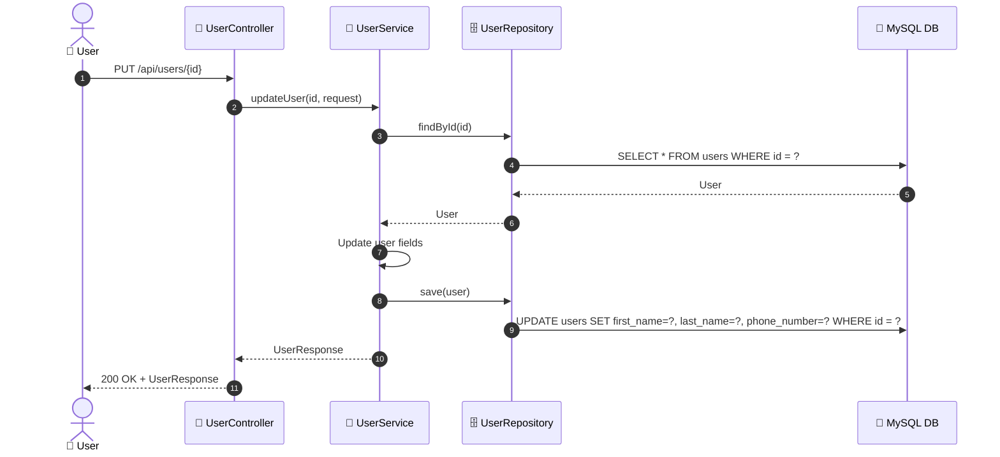

# SEQ-009b: Update Profile

> **Sequence ID:** SEQ-009b
> **Maps to:** UC-009b
> **Phiên bản:** 1.0.0
> **Ngày:** 2026-04-25

---

## 1. Update Profile

---

*Generated by Senior BA Agent | BookStore Backend | 2026-04-25*
