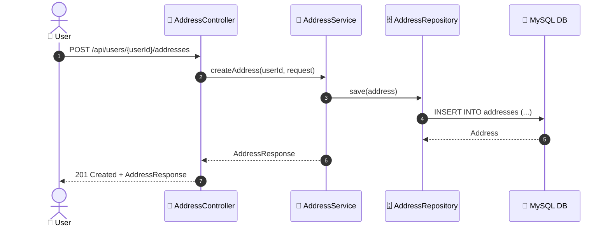
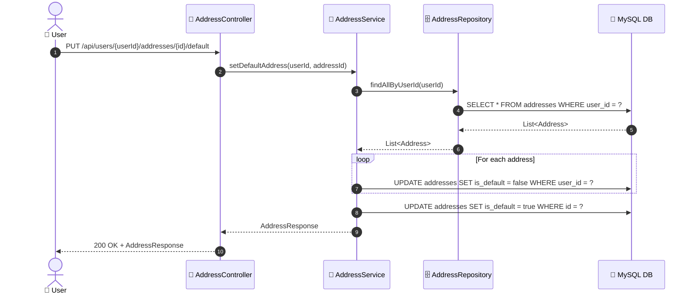

# SEQ-009c: Manage Addresses

> **Sequence ID:** SEQ-009c
> **Maps to:** UC-009c
> **Phiên bản:** 1.0.0
> **Ngày:** 2026-04-25

---

## 1. Add Address

---

## 2. Set Default Address

---

*Generated by Senior BA Agent | BookStore Backend | 2026-04-25*
