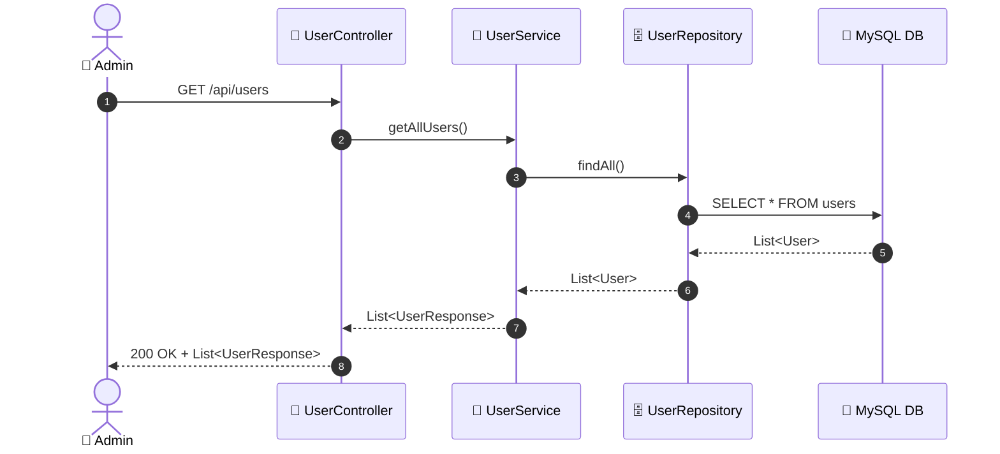

# SEQ-009d: View All Users

> **Sequence ID:** SEQ-009d
> **Maps to:** UC-009d
> **Phiên bản:** 1.0.0
> **Ngày:** 2026-04-25

---

## 1. View All Users

---

*Generated by Senior BA Agent | BookStore Backend | 2026-04-25*
