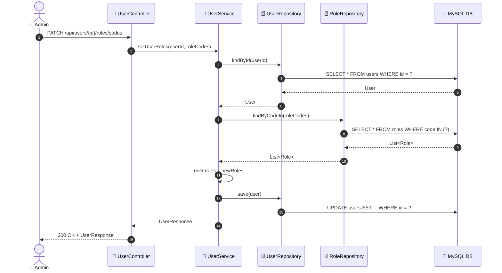

# SEQ-009e: Set User Roles

> **Sequence ID:** SEQ-009e
> **Maps to:** UC-009e
> **Phiên bản:** 1.0.0
> **Ngày:** 2026-04-25

---

## 1. Set User Roles

---

*Generated by Senior BA Agent | BookStore Backend | 2026-04-25*
