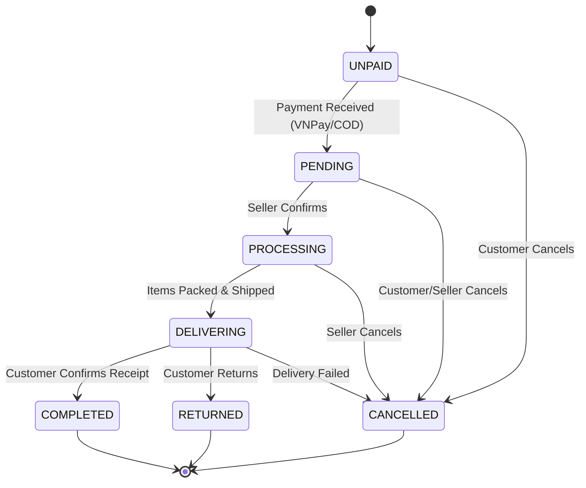
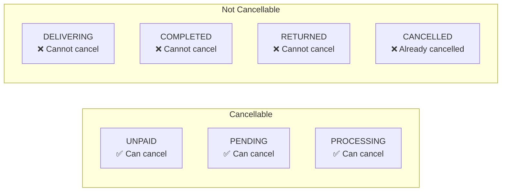

# State Machine - Order Lifecycle

> **Document ID:** state-001
> **Phiên bản:** 1.0.0
> **Ngày:** 2026-04-25
> **Entity:** Order

---

## Order Status Flow

---

## Status Definitions

| Status | Code | Description |
|--------|------|-------------|
| **UNPAID** | `UNPAID` | Order created, awaiting payment |
| **PENDING** | `PENDING` | Payment received, waiting to be processed |
| **PROCESSING** | `PROCESSING` | Order is being prepared/packed |
| **DELIVERING** | `DELIVERING` | Order has been shipped |
| **COMPLETED** | `COMPLETED` | Order delivered successfully |
| **CANCELLED** | `CANCELLED` | Order was cancelled |
| **RETURNED** | `RETURNED` | Order was returned by customer |

---

## Transition Rules

| From | To | Trigger | Actor | Side Effects |
|------|----|---------|-------|-------------|
| UNPAID | PENDING | Payment confirmed | System (VNPay) / User (COD) | paymentCode set |
| UNPAID | CANCELLED | Cancel | Customer | Stock restored |
| PENDING | PROCESSING | Confirm | Seller | Notification sent |
| PENDING | CANCELLED | Cancel | Customer/Seller | Stock restored |
| PROCESSING | DELIVERING | Ship | Seller | Notification sent |
| PROCESSING | CANCELLED | Cancel | Seller | Stock restored |
| DELIVERING | COMPLETED | Confirm receipt | Customer | Notification sent |
| DELIVERING | RETURNED | Return | Customer | Stock handled |
| DELIVERING | CANCELLED | Failed | System/Seller | Stock restored |

---

## Cancellable States

---

## Related Documents

- **Use Case:** `usecase/uc-004.md`, `usecase/uc-005.md`
- **Sequence:** `sequence/seq-004.md`, `sequence/seq-005.md`

---

*Generated by Senior BA Agent | BookStore Backend | 2026-04-25*
