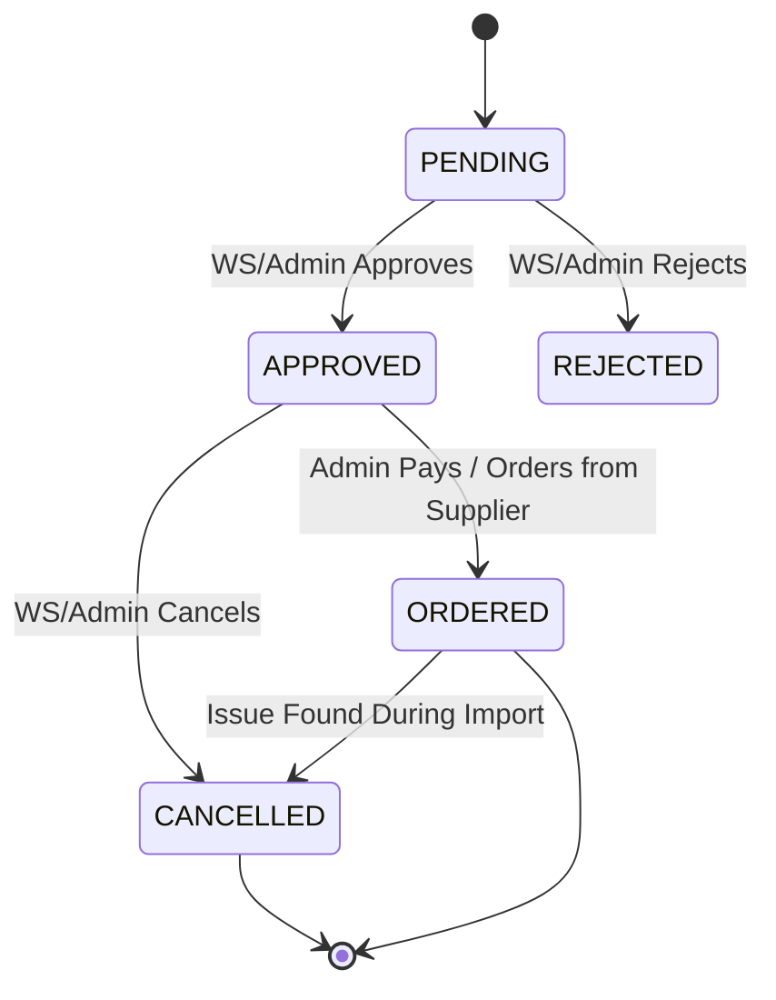

# State Machine - Purchase Order Lifecycle

> **Document ID:** state-002
> **Phiên bản:** 1.0.0
> **Ngày:** 2026-04-25
> **Entity:** PurchaseOrder

---

## Purchase Order Status Flow

---

## Status Definitions

| Status | Code | Description |
|--------|------|-------------|
| **PENDING** | `PENDING` | PO created, awaiting approval |
| **APPROVED** | `APPROVED` | Approved, waiting to be ordered with supplier |
| **REJECTED** | `REJECTED` | Rejected by WS/Admin |
| **ORDERED** | `ORDERED` | Ordered from supplier, awaiting delivery |
| **CANCELLED** | `CANCELLED` | Cancelled (after approval or during import) |

---

## Transition Rules

| From | To | Trigger | Actor | Side Effects |
|------|----|---------|-------|-------------|
| PENDING | APPROVED | Approve | WS/Admin | approvedAt set |
| PENDING | REJECTED | Reject | WS/Admin | - |
| APPROVED | ORDERED | Pay/Order | Admin | - |
| APPROVED | CANCELLED | Cancel | WS/Admin | - |
| ORDERED | CANCELLED | Cancel | WS/Admin | - |

---

## Related Documents

- **Use Case:** `usecase/uc-010.md`
- **Sequence:** `sequence/seq-006.md`

---

*Generated by Senior BA Agent | BookStore Backend | 2026-04-25*
