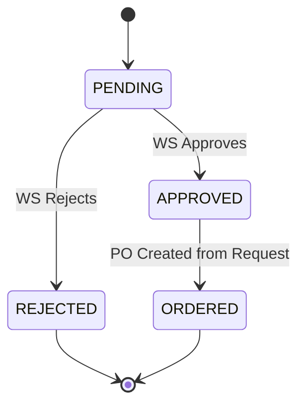
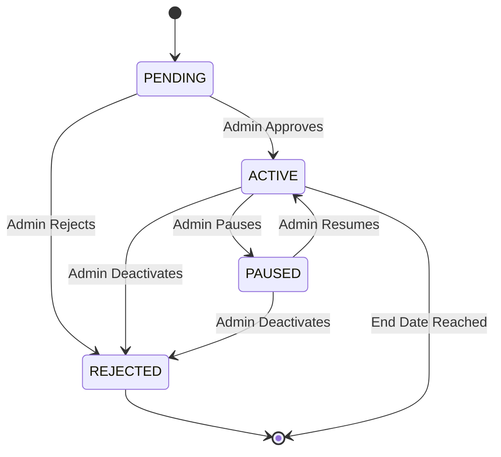

# State Machine - Stock Request & Promotion Lifecycle

> **Document ID:** state-003
> **Phiên bản:** 1.0.0
> **Ngày:** 2026-04-25
> **Entities:** StockRequest, Promotion

---

## Stock Request Status Flow

### StockRequest Definitions

| Status | Code | Description |
|--------|------|-------------|
| **PENDING** | `PENDING` | Request created, awaiting approval |
| **APPROVED** | `APPROVED` | Approved by WS |
| **REJECTED** | `REJECTED` | Rejected by WS |
| **ORDERED** | `ORDERED` | PO created from this request |

---

## Promotion Status Flow

### Promotion Definitions

| Status | Code | Description |
|--------|------|-------------|
| **PENDING** | `PENDING` | Created, awaiting approval |
| **ACTIVE** | `ACTIVE` | Live and usable |
| **REJECTED** | `REJECTED` | Rejected by admin |
| **PAUSED** | `PAUSED` | Temporarily paused |

### Validation Rules for Active Promotion

| Rule | Condition |
|------|-----------|
| 1 | status == ACTIVE |
| 2 | current date >= startDate |
| 3 | current date <= endDate |
| 4 | quantity > 0 (not exhausted) |
| 5 | priceOrderActive <= order.totalAmount |

---

## Related Documents

- **StockRequest:** `usecase/uc-010.md`, `sequence/seq-006.md`
- **Promotion:** `usecase/uc-008.md`, `sequence/seq-009.md`

---

*Generated by Senior BA Agent | BookStore Backend | 2026-04-25*
