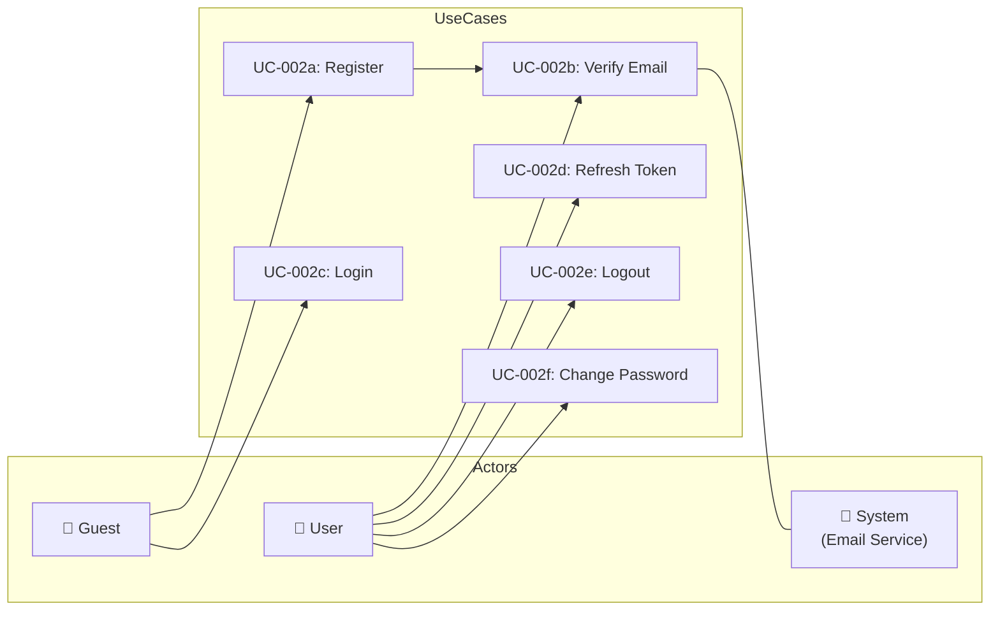

# UC-002: Authentication

> **Use Case ID:** UC-002
> **Phiên bản:** 1.0.0
> **Ngày:** 2026-04-25
> **Actor:** Guest, User
> **Priority:** Critical

---

## 1. Mô tả

Quản lý xác thực người dùng bao gồm đăng ký tài khoản mới, xác thực email, đăng nhập, đăng xuất, refresh token, và đổi mật khẩu. Đây là use case nền tảng cho toàn bộ hệ thống.

---

## 2. Sub Use Cases

| ID | Tên | Actor |
|----|-----|-------|
| [UC-002a](./auth/uc-002a-register.md) | Register | Guest |
| [UC-002b](./auth/uc-002b-verify-email.md) | Verify Email | User |
| [UC-002c](./auth/uc-002c-login.md) | Login | Guest |
| [UC-002d](./auth/uc-002d-refresh-token.md) | Refresh Token | User |
| [UC-002e](./auth/uc-002e-logout.md) | Logout | User |
| [UC-002f](./auth/uc-002f-change-password.md) | Change Password | User |

---

## 3. Use Case Diagram

---

## 4. Related Documents

- **Sequence:** [seq-002a](./auth/seq-002a-register.md), [seq-002b](./auth/seq-002b-verify-email.md), [seq-002c](./auth/seq-002c-login.md), [seq-002d](./auth/seq-002d-refresh-token.md), [seq-002e](./auth/seq-002e-logout.md), [seq-002f](./auth/seq-002f-change-password.md)

---

*Generated by Senior BA Agent | BookStore Backend | 2026-04-25*
