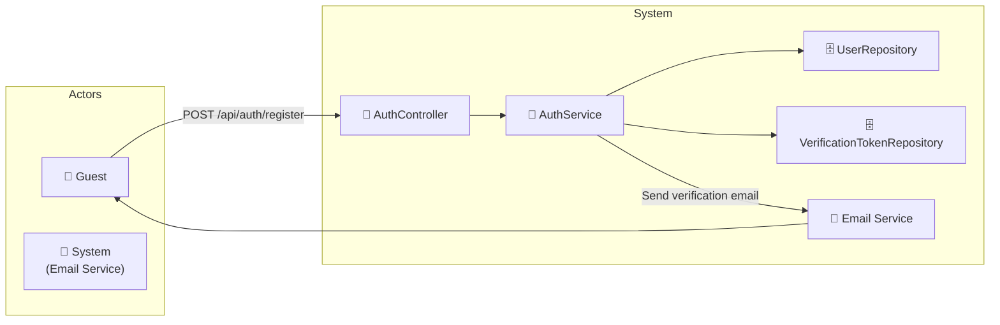

# UC-002a: Register

> **Use Case ID:** UC-002a
> **Parent:** UC-002 (Authentication)
> **Phiên bản:** 1.0.0
> **Ngày:** 2026-04-25
> **Actor:** Guest
> **Priority:** Critical

---

## 1. Mô tả

Cho phép Guest đăng ký tài khoản mới trong hệ thống. Sau khi đăng ký, hệ thống sẽ gửi email xác thực để kích hoạt tài khoản.

---

## 2. Use Case Diagram



---

## 3. Basic Flow

| Step | Actor | System | Action |
|------|-------|--------|--------|
| 1 | Guest | | Gửi `POST /api/auth/register` với thông tin tài khoản |
| 2 | | AuthController | Validate request, chuyển sang AuthService |
| 3 | | AuthService | Kiểm tra email đã tồn tại chưa |
| 4 | | | Tạo User entity với `isActive = false` |
| 5 | | | Hash password với BCrypt |
| 6 | | UserRepository | Lưu User vào database |
| 7 | | AuthService | Tạo VerificationToken (hết hạn sau 24h) |
| 8 | | VerificationTokenRepository | Lưu token |
| 9 | | EmailService | Gửi email xác thực cho user |
| 10 | | | Trả về `RegisterResponse` |
| 11 | Guest | | Nhận response (tài khoản chưa active) |

---

## 4. API Endpoint

```
POST /api/auth/register
Body: {
  "email": "user@example.com",
  "password": "SecurePass123",
  "firstName": "Nguyen",
  "lastName": "Van A",
  "phoneNumber": "0912345678"
}
Auth: Không cần (public)
```

---

## 5. Alternative Flows

### 5.1 Email Already Exists
- Nếu email đã tồn tại:
  - Trả về HTTP 400 "Email already exists"

### 5.2 Invalid Password
- Nếu password không đủ mạnh:
  - Trả về HTTP 400 với thông báo validation errors

### 5.3 Email Service Failure
- Nếu không gửi được email:
  - Vẫn tạo tài khoản thành công
  - Log lỗi để admin xử lý sau

---

## 6. Data Model

### RegisterRequest
```json
{
  "email": "user@example.com",
  "password": "SecurePass123",
  "firstName": "Nguyen",
  "lastName": "Van A",
  "phoneNumber": "0912345678"
}
```

### RegisterResponse
```json
{
  "id": 1,
  "email": "user@example.com",
  "firstName": "Nguyen",
  "lastName": "Van A",
  "message": "Registration successful. Please verify your email."
}
```

---

## 7. Security Requirements

| Rule | Description |
|------|-------------|
| SR-001 | Password phải được hash trước khi lưu (BCrypt) |
| SR-002 | VerificationToken phải có expiry time (24h) |
| SR-003 | Email không phân biệt hoa/thường |

---

## 8. Preconditions

| Condition | Description |
|-----------|-------------|
| CP-001 | Guest chưa có tài khoản trong hệ thống |
| CP-002 | Email service phải được cấu hình đúng |

---

## 9. Postconditions

| Condition | Description |
|-----------|-------------|
| PS-001 | User mới được tạo với `isActive = false` |
| PS-002 | VerificationToken được tạo và gửi qua email |

---

## 10. Acceptance Criteria

| ID | Criteria | Test |
|----|----------|------|
| AC-001 | Guest có thể đăng ký tài khoản mới | `POST /api/auth/register` → 201 |
| AC-002 | Email xác thực được gửi sau đăng ký | Kiểm tra inbox email |
| AC-003 | Email trùng lặp bị từ chối | → 400 |
| AC-004 | Password không đủ mạnh bị từ chối | → 400 |

---

## 11. Related Documents

- **Sequence:** `seq-002a-register.md`

---

*Generated by Senior BA Agent | BookStore Backend | 2026-04-25*
