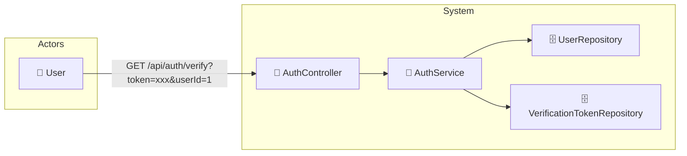

# UC-002b: Verify Email

> **Use Case ID:** UC-002b
> **Parent:** UC-002 (Authentication)
> **Phiên bản:** 1.0.0
> **Ngày:** 2026-04-25
> **Actor:** User
> **Priority:** Critical

---

## 1. Mô tả

Cho phép User xác thực email bằng cách click vào link trong email. Sau khi xác thực thành công, tài khoản sẽ được kích hoạt và user có thể đăng nhập.

---

## 2. Use Case Diagram



---

## 3. Basic Flow

| Step | Actor | System | Action |
|------|-------|--------|--------|
| 1 | User | | Click link trong email: `GET /api/auth/verify?token=xxx&userId=1` |
| 2 | | AuthController | Gọi `authService.verifyEmailTokenForUser()` |
| 3 | | AuthService | Tìm VerificationToken theo token |
| 4 | | VerificationTokenRepository | Query token trong database |
| 5 | | AuthService | Kiểm tra token còn hạn |
| 6 | | | Kiểm tra token.userId == userId |
| 7 | | UserRepository | Tìm User theo userId |
| 8 | | | Cập nhật User `isActive = true` |
| 9 | | VerificationTokenRepository | Xóa VerificationToken |
| 10 | User | | Nhận HTTP 204 (no content) - email verified |

---

## 4. API Endpoints

```
GET /api/auth/verify?token={token}&userId={userId}
POST /api/auth/verify/{userId} (body: { "verifyToken": "xxx" })
```

---

## 5. Alternative Flows

### 5.1 Token Not Found
- Nếu token không tồn tại:
  - Trả về HTTP 400 "Invalid verification token"

### 5.2 Token Expired
- Nếu token đã hết hạn:
  - Trả về HTTP 400 "Verification token has expired"

### 5.3 Token User Mismatch
- Nếu userId trong URL không khớp với token:
  - Trả về HTTP 400 "Invalid token for this user"

### 5.4 User Already Verified
- Nếu user đã verify trước đó:
  - Trả về HTTP 400 "Email already verified"

---

## 6. Token Structure

### VerificationToken
| Field | Type | Description |
|-------|------|-------------|
| id | Long | Primary key |
| token | String | Unique verification token (UUID) |
| userId | Long | User ID associated with token |
| createdAt | LocalDateTime | Token creation time |
| expiresAt | LocalDateTime | Token expiration (24h after creation) |

---

## 7. Security Requirements

| Rule | Description |
|------|-------------|
| SR-001 | Token phải là UUID duy nhất |
| SR-002 | Token chỉ được sử dụng một lần |
| SR-003 | Token hết hạn sau 24 giờ |

---

## 8. Preconditions

| Condition | Description |
|-----------|-------------|
| CP-001 | User phải có VerificationToken trong database |
| CP-002 | Token phải còn trong thời hạn 24 giờ |

---

## 9. Postconditions

| Condition | Description |
|-----------|-------------|
| PS-001 | User.isActive = true |
| PS-002 | VerificationToken bị xóa khỏi database |

---

## 10. Acceptance Criteria

| ID | Criteria | Test |
|----|----------|------|
| AC-001 | User có thể verify email với token hợp lệ | → 204 No Content |
| AC-002 | Token không tồn tại bị từ chối | → 400 |
| AC-003 | Token hết hạn bị từ chối | → 400 |
| AC-004 | User đã verify không thể verify lại | → 400 |

---

## 11. Related Documents

- **Sequence:** `seq-002b-verify-email.md`

---

*Generated by Senior BA Agent | BookStore Backend | 2026-04-25*
