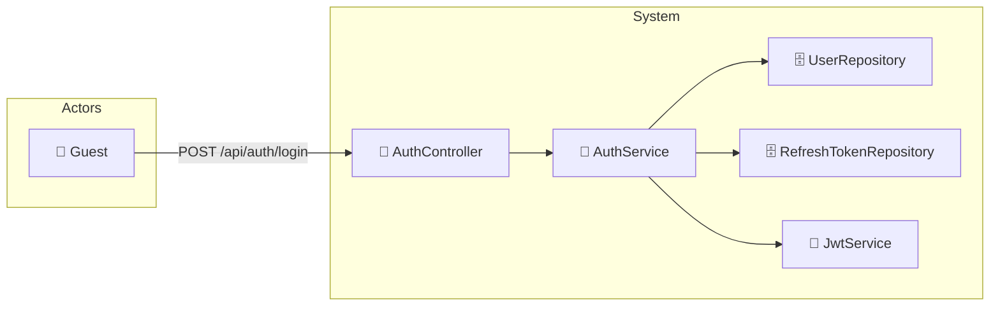

# UC-002c: Login

> **Use Case ID:** UC-002c
> **Parent:** UC-002 (Authentication)
> **Phiên bản:** 1.0.0
> **Ngày:** 2026-04-25
> **Actor:** Guest
> **Priority:** Critical

---

## 1. Mô tả

Cho phép Guest đăng nhập vào hệ thống với email và password. Sau khi đăng nhập thành công, hệ thống trả về Access Token (JWT) và Refresh Token.

---

## 2. Use Case Diagram



---

## 3. Basic Flow

| Step | Actor | System | Action |
|------|-------|--------|--------|
| 1 | Guest | | Gửi `POST /api/auth/login` với email + password |
| 2 | | AuthController | Validate request, gọi `authService.login()` |
| 3 | | AuthService | Tìm user theo email |
| 4 | | UserRepository | Query user trong database |
| 5 | | | Kiểm tra password hash với BCrypt |
| 6 | | | Kiểm tra user đã verify email (`isActive = true`) |
| 7 | | JwtService | Tạo Access Token (JWT) |
| 8 | | | Tạo Refresh Token (UUID) |
| 9 | | RefreshTokenRepository | Lưu Refresh Token vào database |
| 10 | | | Trả về `AuthenticationResponse` |
| 11 | Guest | | Nhận tokens, lưu vào client storage |

---

## 4. API Endpoint

```
POST /api/auth/login
Body: {
  "email": "user@example.com",
  "password": "SecurePass123"
}
Auth: Không cần (public)
```

---

## 5. Alternative Flows

### 5.1 User Not Found
- Nếu email không tồn tại:
  - Trả về HTTP 401 "Invalid credentials"

### 5.2 Invalid Password
- Nếu password sai:
  - Trả về HTTP 401 "Invalid credentials"

### 5.3 User Not Active
- Nếu user chưa verify email:
  - Trả về HTTP 403 "Please verify your email first"

### 5.4 User Deactivated
- Nếu user bị deactivate:
  - Trả về HTTP 403 "Account has been deactivated"

---

## 6. Data Model

### AuthenticationRequest
```json
{
  "email": "user@example.com",
  "password": "SecurePass123"
}
```

### AuthenticationResponse
```json
{
  "token": "eyJhbGciOiJIUzI1NiJ9...",
  "refreshToken": "dGhpcyBpcyBhIHJlZnJlc2ggdG9rZW4...",
  "tokenType": "Bearer",
  "expiresIn": 3600
}
```

### JWT Token Structure
```json
{
  "sub": "user@example.com",
  "userId": 1,
  "roles": ["ROLE_USER"],
  "iat": 1745539200,
  "exp": 1745542800
}
```

---

## 7. Security Requirements

| Rule | Description |
|------|-------------|
| SR-001 | Password được verify với BCrypt |
| SR-002 | JWT secret phải đủ dài (ít nhất 256 bits) |
| SR-003 | Refresh token được lưu trong DB để có thể revoke |
| SR-004 | Chỉ user đã verify mới được login |

---

## 8. Preconditions

| Condition | Description |
|-----------|-------------|
| CP-001 | Guest phải có tài khoản trong hệ thống |
| CP-002 | Tài khoản phải đã được verify email |

---

## 9. Postconditions

| Condition | Description |
|-----------|-------------|
| PS-001 | RefreshToken được lưu trong database |
| PS-002 | Actor nhận được access token và refresh token |

---

## 10. Acceptance Criteria

| ID | Criteria | Test |
|----|----------|------|
| AC-001 | Guest có thể đăng nhập thành công | `POST /api/auth/login` → 200 |
| AC-002 | Credentials sai bị từ chối | → 401 |
| AC-003 | User chưa verify bị từ chối | → 403 |
| AC-004 | Response chứa đúng token | Kiểm tra JWT payload |

---

## 11. Related Documents

- **Sequence:** `seq-002c-login.md`

---

*Generated by Senior BA Agent | BookStore Backend | 2026-04-25*
