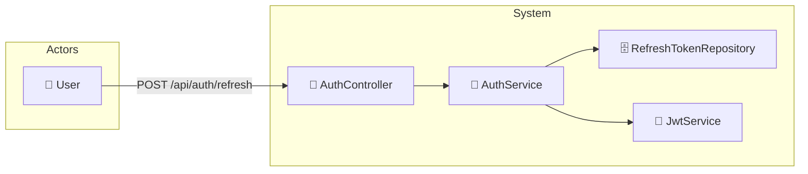

# UC-002d: Refresh Token

> **Use Case ID:** UC-002d
> **Parent:** UC-002 (Authentication)
> **Phiên bản:** 1.0.0
> **Ngày:** 2026-04-25
> **Actor:** User
> **Priority:** Critical

---

## 1. Mô tả

Cho phép User lấy Access Token mới từ Refresh Token khi Access Token hết hạn. Refresh Token có thời gian sống dài hơn và được sử dụng để duy trì phiên đăng nhập.

---

## 2. Use Case Diagram



---

## 3. Basic Flow

| Step | Actor | System | Action |
|------|-------|--------|--------|
| 1 | User | | Gửi `POST /api/auth/refresh` với refresh token |
| 2 | | AuthController | Gọi `authService.refreshToken()` |
| 3 | | AuthService | Tìm RefreshToken theo token string |
| 4 | | RefreshTokenRepository | Query token trong database |
| 5 | | AuthService | Kiểm tra token còn valid (chưa revoked, chưa hết hạn) |
| 6 | | JwtService | Tạo Access Token mới từ user info |
| 7 | | | Trả về `RefreshTokenResponse` |
| 8 | User | | Nhận Access Token mới |

---

## 4. API Endpoint

```
POST /api/auth/refresh
Body: {
  "refreshToken": "dGhpcyBpcyBhIHJlZnJlc2ggdG9rZW4..."
}
Auth: Không cần (public - nhưng cần valid refresh token)
```

---

## 5. Alternative Flows

### 5.1 Token Not Found
- Nếu refresh token không tồn tại:
  - Trả về HTTP 401 "Token not found"

### 5.2 Token Expired
- Nếu refresh token đã hết hạn:
  - Trả về HTTP 401 "Token expired"

### 5.3 Token Revoked
- Nếu refresh token đã bị revoke (logout):
  - Trả về HTTP 401 "Token has been revoked"

### 5.4 Token Used (Optional - Single Use)
- Nếu hệ thống dùng single-use refresh token:
  - Xóa token cũ sau khi sử dụng
  - Tạo refresh token mới cùng với access token mới

---

## 6. Data Model

### RefreshTokenRequest
```json
{
  "refreshToken": "dGhpcyBpcyBhIHJlZnJlc2ggdG9rZW4..."
}
```

### RefreshTokenResponse
```json
{
  "token": "eyJhbGciOiJIUzI1NiJ9...",
  "refreshToken": "bmV3IHJlZnJlc2ggdG9rZW4...",
  "tokenType": "Bearer",
  "expiresIn": 3600
}
```

### RefreshToken Entity
| Field | Type | Description |
|-------|------|-------------|
| id | Long | Primary key |
| token | String | Unique refresh token (UUID) |
| userId | Long | User ID associated |
| expiryDate | LocalDateTime | Token expiration (e.g., 7-30 days) |
| revoked | boolean | Token revoked flag |
| createdAt | LocalDateTime | Token creation time |

---

## 7. Security Requirements

| Rule | Description |
|------|-------------|
| SR-001 | Refresh token được lưu trong DB để có thể revoke |
| SR-002 | Token hết hạn không thể sử dụng |
| SR-003 | Token đã revoke không thể sử dụng |

---

## 8. Preconditions

| Condition | Description |
|-----------|-------------|
| CP-001 | User phải có Refresh Token hợp lệ |
| CP-002 | Refresh Token chưa bị revoke |
| CP-003 | Refresh Token chưa hết hạn |

---

## 9. Postconditions

| Condition | Description |
|-----------|-------------|
| PS-001 | User nhận được Access Token mới |
| PS-002 | (Optional) Refresh Token cũ được revoke và tạo mới |

---

## 10. Acceptance Criteria

| ID | Criteria | Test |
|----|----------|------|
| AC-001 | Refresh token hợp lệ trả về access token mới | → 200 |
| AC-002 | Token hết hạn bị từ chối | → 401 |
| AC-003 | Token đã revoke bị từ chối | → 401 |

---

## 11. Related Documents

- **Sequence:** `seq-002d-refresh-token.md`

---

*Generated by Senior BA Agent | BookStore Backend | 2026-04-25*
