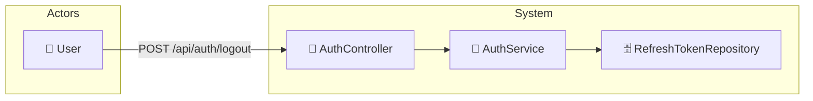

# UC-002e: Logout

> **Use Case ID:** UC-002e
> **Parent:** UC-002 (Authentication)
> **Phiên bản:** 1.0.0
> **Ngày:** 2026-04-25
> **Actor:** User
> **Priority:** Critical

---

## 1. Mô tả

Cho phép User đăng xuất khỏi hệ thống. Khi logout, Refresh Token sẽ bị revoke để ngăn việc sử dụng lại token.

---

## 2. Use Case Diagram



---

## 3. Basic Flow

| Step | Actor | System | Action |
|------|-------|--------|--------|
| 1 | User | | Gửi `POST /api/auth/logout` với refresh token |
| 2 | | AuthController | Gọi `authService.logout()` |
| 3 | | AuthService | Tìm RefreshToken trong DB |
| 4 | | RefreshTokenRepository | Query token |
| 5 | | | Đặt `revoked = true` cho token |
| 6 | | | Lưu vào database |
| 7 | | | Trả về HTTP 204 |
| 8 | User | | Xóa tokens khỏi client storage |

---

## 4. API Endpoint

```
POST /api/auth/logout
Body: {
  "refreshToken": "dGhpcyBpcyBhIHJlZnJlc2ggdG9rZW4..."
}
Auth: Cần đăng nhập (để xác định user)
```

---

## 5. Alternative Flows

### 5.1 Token Not Found
- Nếu refresh token không tồn tại:
  - Vẫn trả về HTTP 204 (stateless cho client)

### 5.2 Token Already Revoked
- Nếu token đã bị revoke trước đó:
  - Vẫn trả về HTTP 204 (idempotent)

---

## 6. Security Requirements

| Rule | Description |
|------|-------------|
| SR-001 | Refresh token bị revoke không thể sử dụng lại |
| SR-002 | Logout là idempotent - gọi nhiều lần vẫn OK |

---

## 7. Preconditions

| Condition | Description |
|-----------|-------------|
| CP-001 | User phải đăng nhập |
| CP-002 | User phải có refresh token |

---

## 8. Postconditions

| Condition | Description |
|-----------|-------------|
| PS-001 | RefreshToken.revoked = true |
| PS-002 | Refresh token không thể dùng để lấy access token mới |

---

## 9. Acceptance Criteria

| ID | Criteria | Test |
|----|----------|------|
| AC-001 | User có thể logout thành công | → 204 No Content |
| AC-002 | Refresh token sau logout bị revoke | Không thể refresh |
| AC-003 | Logout nhiều lần vẫn OK | → 204 |

---

## 10. Related Documents

- **Sequence:** `seq-002e-logout.md`

---

*Generated by Senior BA Agent | BookStore Backend | 2026-04-25*
