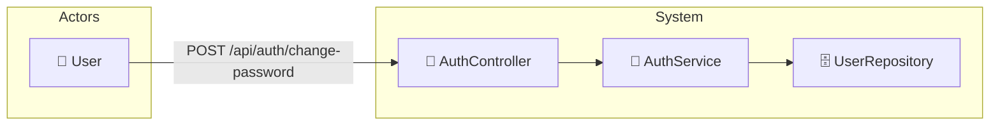

# UC-002f: Change Password

> **Use Case ID:** UC-002f
> **Parent:** UC-002 (Authentication)
> **Phiên bản:** 1.0.0
> **Ngày:** 2026-04-25
> **Actor:** User
> **Priority:** High

---

## 1. Mô tả

Cho phép User thay đổi mật khẩu của tài khoản. User phải xác thực mật khẩu cũ trước khi đặt mật khẩu mới.

---

## 2. Use Case Diagram



---

## 3. Basic Flow

| Step | Actor | System | Action |
|------|-------|--------|--------|
| 1 | User | | Gửi `POST /api/auth/change-password` |
| 2 | | AuthController | Extract user từ JWT token |
| 3 | | AuthService | Tìm User theo email từ JWT |
| 4 | | UserRepository | Query user |
| 5 | | | Xác thực mật khẩu cũ với BCrypt |
| 6 | | | Hash mật khẩu mới |
| 7 | | | Cập nhật User.password |
| 8 | | UserRepository | Lưu user |
| 9 | | | Trả về HTTP 204 |

---

## 4. API Endpoint

```
POST /api/auth/change-password
Headers: Authorization: Bearer {accessToken}
Body: {
  "oldPassword": "CurrentPass123",
  "newPassword": "NewPass456"
}
```

---

## 5. Alternative Flows

### 5.1 Old Password Incorrect
- Nếu mật khẩu cũ sai:
  - Trả về HTTP 400 "Invalid old password"

### 5.2 New Password Same as Old
- Nếu mật khẩu mới trùng với mật khẩu cũ:
  - Trả về HTTP 400 "New password must be different from old password"

### 5.3 New Password Too Weak
- Nếu mật khẩu mới không đủ mạnh:
  - Trả về HTTP 400 với danh sách validation errors

### 5.4 User Not Found
- Nếu user không tồn tại (edge case):
  - Trả về HTTP 404

---

## 6. Data Model

### ChangePasswordRequest
```json
{
  "oldPassword": "CurrentPass123",
  "newPassword": "NewPass456"
}
```

### Validation Rules for New Password
| Rule | Description |
|------|-------------|
| minLength | Tối thiểu 8 ký tự |
| hasUpperCase | Ít nhất 1 ký tự hoa |
| hasLowerCase | Ít nhất 1 ký tự thường |
| hasDigit | Ít nhất 1 chữ số |
| hasSpecialChar | Ít nhất 1 ký tự đặc biệt |

---

## 7. Security Requirements

| Rule | Description |
|------|-------------|
| SR-001 | Mật khẩu phải được hash trước khi lưu |
| SR-002 | Phải xác thực mật khẩu cũ |

---

## 8. Preconditions

| Condition | Description |
|-----------|-------------|
| CP-001 | User phải đăng nhập |
| CP-002 | User phải biết mật khẩu cũ |

---

## 9. Postconditions

| Condition | Description |
|-----------|-------------|
| PS-001 | User.password được cập nhật với mật khẩu mới (hashed) |

---

## 10. Acceptance Criteria

| ID | Criteria | Test |
|----|----------|------|
| AC-001 | User có thể đổi mật khẩu thành công | → 204 No Content |
| AC-002 | Mật khẩu cũ sai bị từ chối | → 400 |
| AC-003 | Mật khẩu mới yếu bị từ chối | → 400 |
| AC-004 | Đăng nhập với mật khẩu mới hoạt động | → 200 |

---

## 11. Related Documents

- **Sequence:** `seq-002f-change-password.md`

---

*Generated by Senior BA Agent | BookStore Backend | 2026-04-25*
