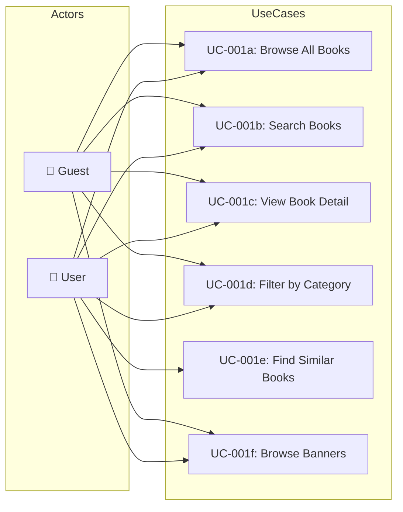

# UC-001: Browse Books

> **Use Case ID:** UC-001
> **Phiên bản:** 1.0.0
> **Ngày:** 2026-04-25
> **Actor:** Guest, User
> **Priority:** High

---

## 1. Mô tả

Cho phép người dùng (đã đăng nhập hoặc chưa) duyệt, tìm kiếm và xem chi tiết sách trong hệ thống. Đây là use case cốt lõi giúp người dùng khám phá sản phẩm.

---

## 2. Sub Use Cases

| ID | Tên | Actor |
|----|-----|-------|
| [UC-001a](./uc-001a-browse-all-books.md) | Browse All Books | Guest, User |
| [UC-001b](./uc-001b-search-books.md) | Search Books | Guest, User |
| [UC-001c](./uc-001c-view-book-detail.md) | View Book Detail | Guest, User |
| [UC-001d](./uc-001d-filter-by-category.md) | Filter by Category | Guest, User |
| [UC-001e](./uc-001e-find-similar-books.md) | Find Similar Books (AI) | User |
| [UC-001f](./uc-001f-browse-banners.md) | Browse Banners | Guest, User |

---

## 3. Use Case Diagram

---

## 4. Related Documents

- **Sequence:** [seq-001a](./seq-001a-browse-all-books.md), [seq-001b](./seq-001b-search-books.md), [seq-001c](./seq-001c-view-book-detail.md), [seq-001d](./seq-001d-filter-by-category.md), [seq-001e](./seq-001e-find-similar-books.md), [seq-001f](./seq-001f-browse-banners.md)

---

*Generated by Senior BA Agent | BookStore Backend | 2026-04-25*
