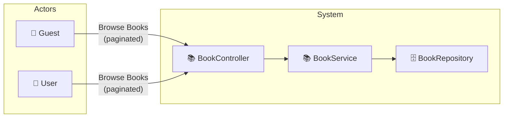

# UC-001a: Browse All Books

> **Use Case ID:** UC-001a
> **Parent:** UC-001 (Browse Books)
> **Phiên bản:** 1.0.0
> **Ngày:** 2026-04-25
> **Actor:** Guest, User
> **Priority:** High

---

## 1. Mô tả

Cho phép người dùng duyệt tất cả sách trong hệ thống với phân trang và sắp xếp. Đây là chức năng cơ bản nhất để xem danh sách sản phẩm.

---

## 2. Use Case Diagram



---

## 3. Basic Flow

| Step | Actor | System | Action |
|------|-------|--------|--------|
| 1 | Guest/User | | Gửi `GET /api/books?page=1&size=10&sortBy=id&sortDir=asc` |
| 2 | | BookController | Nhận request, chuyển sang BookService |
| 3 | | BookService | Gọi repository tìm tất cả books (paginated) |
| 4 | | | Trả về `PageResponse<BookResponse>` |
| 5 | Guest/User | | Nhận danh sách books với pagination |

---

## 4. API Endpoint

```
GET /api/books
Query Params:
  - page (default: 1)
  - size (default: 10)
  - sortBy (default: id)
  - sortDir (asc/desc)
Auth: Không cần (public)
```

---

## 5. Alternative Flows

### 5.1 Empty Result
- Khi không có book nào:
  - Trả về empty page `[]`
  - HTTP 200

### 5.2 Invalid Pagination
- Khi page < 1: mặc định page = 1
- Khi size > 100: giới hạn size = 100

---

## 6. Data Model

### BookResponse Fields
```json
{
  "id": 1,
  "title": "Clean Code",
  "author": "Robert C. Martin",
  "description": "...",
  "publicationYear": 2008,
  "weightGrams": 500,
  "pageCount": 431,
  "price": 250000.00,
  "stockQuantity": 50,
  "imageUrl": "https://...",
  "isActive": true,
  "categories": [...],
  "variants": [...],
  "supplier": {...}
}
```

### PageResponse
```json
{
  "content": [...],
  "page": 1,
  "size": 10,
  "totalElements": 100,
  "totalPages": 10
}
```

---

## 7. Preconditions

| Condition | Description |
|-----------|-------------|
| CP-001 | Không cần đăng nhập (public API) |
| CP-002 | Database phải có ít nhất 1 book |

---

## 8. Postconditions

| Condition | Description |
|-----------|-------------|
| PS-001 | Actor nhận được danh sách books đã được paginated/sorted |

---

## 9. Business Rules

| Rule | Description |
|------|-------------|
| BR-001 | Chỉ books có `isActive = true` mới hiển thị |
| BR-002 | Pagination default: page=1, size=10 |
| BR-003 | Sort direction: `asc` hoặc `desc` |

---

## 10. Acceptance Criteria

| ID | Criteria | Test |
|----|----------|------|
| AC-001 | Guest có thể browse all books mà không cần đăng nhập | `GET /api/books` → 200 |
| AC-002 | Books được paginated đúng | Response có `page`, `size`, `totalElements` |
| AC-003 | Có thể sort theo bất kỳ field nào | `?sortBy=price&sortDir=desc` |

---

## 11. Related Documents

- **Sequence:** `seq-001a-browse-all-books.md`

---

*Generated by Senior BA Agent | BookStore Backend | 2026-04-25*
