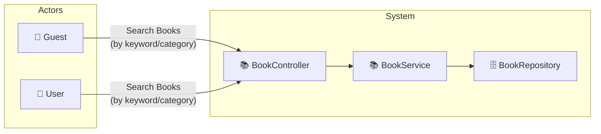

# UC-001b: Search Books

> **Use Case ID:** UC-001b
> **Parent:** UC-001 (Browse Books)
> **Phiên bản:** 1.0.0
> **Ngày:** 2026-04-25
> **Actor:** Guest, User
> **Priority:** High

---

## 1. Mô tả

Cho phép người dùng tìm kiếm sách theo từ khóa và/hoặc theo danh mục. Hỗ trợ phân trang kết quả tìm kiếm.

---

## 2. Use Case Diagram



---

## 3. Basic Flow

### 3.1 Search by Keyword

| Step | Actor | System | Action |
|------|-------|--------|--------|
| 1 | Guest/User | | Gửi `GET /api/books/search?keyword=clean+code` |
| 2 | | BookController | Gọi `bookService.searchBooks(keyword)` |
| 3 | | BookService | Tìm kiếm trong title, author, description |
| 4 | | | Trả về `PageResponse<BookResponse>` |
| 5 | Guest/User | | Nhận kết quả tìm kiếm |

### 3.2 Search by Category

| Step | Actor | System | Action |
|------|-------|--------|--------|
| 1 | Guest/User | | Gửi `GET /api/books/search?categoryId=1` |
| 2 | | BookController | Gọi `bookService.searchBooksByCategory(categoryId)` |
| 3 | | | Trả về danh sách books thuộc category |
| 4 | Guest/User | | Nhận kết quả |

### 3.3 Search Combined (Keyword + Category)

| Step | Actor | System | Action |
|------|-------|--------|--------|
| 1 | Guest/User | | Gửi `GET /api/books/search?keyword=java&categoryId=2` |
| 2 | | BookController | Gọi `bookService.searchBooks(keyword, categoryId)` |
| 3 | | | Tìm kiếm kết hợp |
| 4 | | | Trả về `PageResponse<BookResponse>` |
| 5 | Guest/User | | Nhận kết quả |

---

## 4. API Endpoints

```
GET /api/books/search
Query Params:
  - keyword (optional): từ khóa tìm kiếm
  - categoryId (optional): ID danh mục
  - page (default: 1)
  - size (default: 10)
Auth: Không cần (public)
```

---

## 5. Alternative Flows

### 5.1 Empty Search
- Khi không có từ khóa và không có category:
  - Trả về tất cả books (giống UC-001a)

### 5.2 No Results
- Khi không tìm thấy kết quả:
  - Trả về empty list `[]`
  - HTTP 200

---

## 6. Preconditions

| Condition | Description |
|-----------|-------------|
| CP-001 | Không cần đăng nhập (public API) |

---

## 7. Postconditions

| Condition | Description |
|-----------|-------------|
| PS-001 | Actor nhận được danh sách books phù hợp với tìm kiếm |

---

## 8. Business Rules

| Rule | Description |
|------|-------------|
| BR-001 | Tìm kiếm không phân biệt hoa/thường |
| BR-002 | Kết quả chỉ bao gồm books có `isActive = true` |

---

## 9. Acceptance Criteria

| ID | Criteria | Test |
|----|----------|------|
| AC-001 | Tìm kiếm theo từ khóa trả về kết quả đúng | `?keyword=clean` |
| AC-002 | Tìm kiếm theo category trả về đúng books | `?categoryId=1` |
| AC-003 | Kết hợp keyword + category hoạt động | `?keyword=java&categoryId=2` |

---

## 10. Related Documents

- **Sequence:** `seq-001b-search-books.md`

---

*Generated by Senior BA Agent | BookStore Backend | 2026-04-25*
