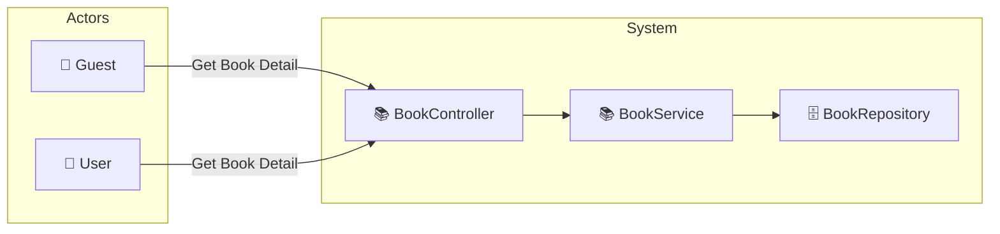

# UC-001c: View Book Detail

> **Use Case ID:** UC-001c
> **Parent:** UC-001 (Browse Books)
> **Phiên bản:** 1.0.0
> **Ngày:** 2026-04-25
> **Actor:** Guest, User
> **Priority:** High

---

## 1. Mô tả

Cho phép người dùng xem chi tiết một cuốn sách bao gồm thông tin cơ bản, danh mục, các biến thể (định dạng), và thông tin nhà cung cấp.

---

## 2. Use Case Diagram



---

## 3. Basic Flow

| Step | Actor | System | Action |
|------|-------|--------|--------|
| 1 | Guest/User | | Gửi `GET /api/books/{bookId}` |
| 2 | | BookController | Gọi `bookService.getBookById(bookId)` |
| 3 | | BookService | Tìm book, load categories, variants, supplier |
| 4 | | | Trả về `BookResponse` với đầy đủ thông tin |
| 5 | Guest/User | | Nhận chi tiết book |

---

## 4. API Endpoint

```
GET /api/books/{bookId}
Auth: Không cần (public)
```

---

## 5. Alternative Flows

### 5.1 Book Not Found
- Khi `GET /api/books/{bookId}` không tìm thấy book:
  - Hệ thống ném `IdInvalidException`
  - Trả về HTTP 400 với message "Book not found"

### 5.2 Book Inactive
- Khi book tồn tại nhưng `isActive = false`:
  - Trả về HTTP 404 "Book not found"

---

## 6. Data Model

### BookResponse (Full Detail)
```json
{
  "id": 1,
  "title": "Clean Code",
  "author": "Robert C. Martin",
  "description": "A handbook of agile software craftsmanship...",
  "isbn": "9780132350884",
  "publicationYear": 2008,
  "weightGrams": 500,
  "pageCount": 431,
  "dimensions": "17.5 x 3.8 x 24.1 cm",
  "price": 250000.00,
  "stockQuantity": 50,
  "imageUrl": "https://example.com/clean-code.jpg",
  "isActive": true,
  "categories": [
    {
      "id": 1,
      "name": "Programming",
      "description": "..."
    }
  ],
  "variants": [
    {
      "id": 1,
      "format": "Hardcover",
      "price": 350000.00,
      "stockQuantity": 20
    },
    {
      "id": 2,
      "format": "Paperback",
      "price": 250000.00,
      "stockQuantity": 30
    }
  ],
  "supplier": {
    "id": 1,
    "name": "Tech Books Publisher",
    "contactPerson": "John Smith",
    "phoneNumber": "0912345678"
  }
}
```

---

## 7. Preconditions

| Condition | Description |
|-----------|-------------|
| CP-001 | Không cần đăng nhập (public API) |
| CP-002 | Book phải tồn tại trong database |

---

## 8. Postconditions

| Condition | Description |
|-----------|-------------|
| PS-001 | Actor nhận được chi tiết đầy đủ của 1 book |
| PS-002 | BookResponse bao gồm categories, variants, supplier |

---

## 9. Business Rules

| Rule | Description |
|------|-------------|
| BR-001 | Chỉ books có `isActive = true` mới được hiển thị |
| BR-002 | Variants được load cùng với Book (Eager load) |

---

## 10. Acceptance Criteria

| ID | Criteria | Test |
|----|----------|------|
| AC-001 | Guest có thể xem chi tiết book | `GET /api/books/1` → 200 |
| AC-002 | Response bao gồm categories và variants | Kiểm tra response fields |
| AC-003 | Book not found trả về error | `GET /api/books/999` → 400 |

---

## 11. Related Documents

- **Sequence:** `seq-001c-view-book-detail.md`

---

*Generated by Senior BA Agent | BookStore Backend | 2026-04-25*
