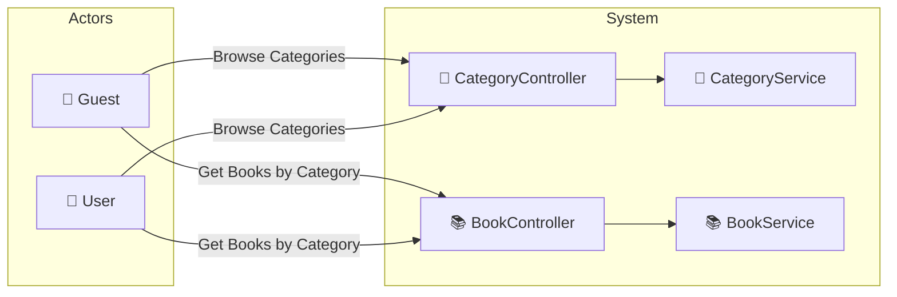

# UC-001d: Filter by Category

> **Use Case ID:** UC-001d
> **Parent:** UC-001 (Browse Books)
> **Phiên bản:** 1.0.0
> **Ngày:** 2026-04-25
> **Actor:** Guest, User
> **Priority:** High

---

## 1. Mô tả

Cho phép người dùng lọc và xem sách theo danh mục (category). Hỗ trợ xem tất cả danh mục và lấy sách theo từng danh mục.

---

## 2. Use Case Diagram



---

## 3. Basic Flow

### 3.1 Browse All Categories

| Step | Actor | System | Action |
|------|-------|--------|--------|
| 1 | Guest/User | | Gửi `GET /api/categories` |
| 2 | | CategoryController | Gọi `categoryService.getAllCategories()` |
| 3 | | CategoryRepository | Query tất cả categories |
| 4 | | | Trả về `List<CategoryResponse>` |
| 5 | Guest/User | | Nhận danh sách thể loại |

### 3.2 Get Books by Category

| Step | Actor | System | Action |
|------|-------|--------|--------|
| 1 | Guest/User | | Gửi `GET /api/books/category/{categoryId}` |
| 2 | | BookController | Gọi `bookService.getBooksByCategoryId(categoryId)` |
| 3 | | BookService | Tìm books thuộc category |
| 4 | | | Trả về `List<BookResponse>` |
| 5 | Guest/User | | Nhận danh sách books theo category |

### 3.3 Get Books by Supplier

| Step | Actor | System | Action |
|------|-------|--------|--------|
| 1 | Guest/User | | Gửi `GET /api/books/supplier/{supplierId}` |
| 2 | | BookController | Gọi `bookService.getBooksBySupplierId(supplierId)` |
| 3 | | | Trả về books từ supplier |
| 4 | Guest/User | | Nhận danh sách books theo supplier |

---

## 4. API Endpoints

```
GET /api/categories
Auth: Không cần (public)

GET /api/books/category/{categoryId}
Auth: Không cần (public)

GET /api/books/supplier/{supplierId}
Auth: Không cần (public)
```

---

## 5. Alternative Flows

### 5.1 Category Not Found
- Khi categoryId không tồn tại:
  - Trả về empty list `[]`
  - HTTP 200

### 5.2 Empty Category
- Khi category tồn tại nhưng không có book nào:
  - Trả về empty list `[]`
  - HTTP 200

---

## 6. Data Model

### CategoryResponse
```json
{
  "id": 1,
  "name": "Programming",
  "description": "Books about programming and software development",
  "imageUrl": "https://example.com/programming.jpg",
  "bookCount": 45
}
```

---

## 7. Preconditions

| Condition | Description |
|-----------|-------------|
| CP-001 | Không cần đăng nhập (public API) |

---

## 8. Postconditions

| Condition | Description |
|-----------|-------------|
| PS-001 | Actor nhận được danh sách categories |
| PS-002 | Actor nhận được books thuộc category đã chọn |

---

## 9. Business Rules

| Rule | Description |
|------|-------------|
| BR-001 | Chỉ categories có `isActive = true` mới được hiển thị |
| BR-002 | Chỉ books có `isActive = true` mới được trả về |

---

## 10. Acceptance Criteria

| ID | Criteria | Test |
|----|----------|------|
| AC-001 | Guest có thể browse tất cả categories | `GET /api/categories` → 200 |
| AC-002 | Có thể filter books theo category | `GET /api/books/category/1` |
| AC-003 | Có thể filter books theo supplier | `GET /api/books/supplier/1` |

---

## 11. Related Documents

- **Sequence:** `seq-001d-filter-by-category.md`

---

*Generated by Senior BA Agent | BookStore Backend | 2026-04-25*
