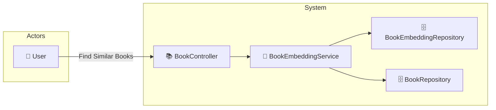

# UC-001e: Find Similar Books (AI)

> **Use Case ID:** UC-001e
> **Parent:** UC-001 (Browse Books)
> **Phiên bản:** 1.0.0
> **Ngày:** 2026-04-25
> **Actor:** User
> **Priority:** Medium

---

## 1. Mô tả

Sử dụng AI (cosine similarity trên book embeddings) để gợi ý những cuốn sách tương tự dựa trên nội dung và đặc điểm của cuốn sách đang xem.

---

## 2. Use Case Diagram



---

## 3. Basic Flow

| Step | Actor | System | Action |
|------|-------|--------|--------|
| 1 | User | | Gửi `GET /api/books/{bookId}/similar?limit=10` |
| 2 | | BookController | Chuyển sang BookEmbeddingService |
| 3 | | BookEmbeddingService | Tìm book embedding hiện tại |
| 4 | | | Tính cosine similarity với tất cả embeddings khác |
| 5 | | | Sắp xếp theo similarity score giảm dần |
| 6 | | | Lấy top N kết quả |
| 7 | | | Fetch book details cho mỗi kết quả |
| 8 | | | Trả về `List<BookResponse>` |
| 9 | User | | Nhận gợi ý sách tương tự |

---

## 4. API Endpoint

```
GET /api/books/{bookId}/similar?limit=10
Auth: Cần đăng nhập (User)
Query Params:
  - limit (default: 10, max: 50)
```

---

## 5. Alternative Flows

### 5.1 Book Not Found
- Khi bookId không tồn tại:
  - Trả về HTTP 400 "Book not found"

### 5.2 No Embedding
- Khi book chưa có embedding vector:
  - Trả về empty list `[]`
  - Hoặc fallback về gợi ý theo category

### 5.3 No Similar Books
- Khi không tìm thấy similar books:
  - Trả về empty list `[]`

---

## 6. Technical Details

### Book Embedding
- Mỗi book có một vector embedding (float array, dimension ~384-1536)
- Embedding được tạo từ: title, author, description, categories
- Sử dụng sentence-transformers hoặc OpenAI embeddings

### Similarity Calculation
```python
similarity = cosine_similarity(embedding_A, embedding_B)
# Hoặc sử dụng vector database như Pinecone/Milvus
```

---

## 7. Preconditions

| Condition | Description |
|-----------|-------------|
| CP-001 | User phải đăng nhập |
| CP-002 | Book phải tồn tại và có embedding |
| CP-003 | Phải có ít nhất 2 books để so sánh |

---

## 8. Postconditions

| Condition | Description |
|-----------|-------------|
| PS-001 | User nhận được danh sách books tương tự |
| PS-002 | Danh sách được sắp xếp theo similarity giảm dần |

---

## 9. Business Rules

| Rule | Description |
|------|-------------|
| BR-001 | Kết quả không bao gồm book gốc (self-exclude) |
| BR-002 | Limit mặc định = 10, tối đa = 50 |
| BR-003 | Chỉ books có `isActive = true` mới được trả về |

---

## 10. Acceptance Criteria

| ID | Criteria | Test |
|----|----------|------|
| AC-001 | User đăng nhập có thể tìm similar books | `GET /api/books/1/similar` → 200 |
| AC-002 | Similar books trả về đúng số lượng | `?limit=5` → 5 books |
| AC-003 | Kết quả không chứa book gốc | Không có bookId gốc |
| AC-004 | Guest không thể sử dụng chức năng | → 401 Unauthorized |

---

## 11. Related Documents

- **Sequence:** `seq-001e-find-similar-books.md`

---

*Generated by Senior BA Agent | BookStore Backend | 2026-04-25*
