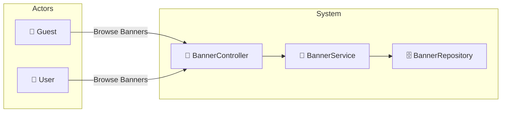

# UC-001f: Browse Banners

> **Use Case ID:** UC-001f
> **Parent:** UC-001 (Browse Books)
> **Phiên bản:** 1.0.0
> **Ngày:** 2026-04-25
> **Actor:** Guest, User
> **Priority:** Medium

---

## 1. Mô tả

Cho phép người dùng xem các banner khuyến mãi hiển thị trên trang chủ. Banners là hình ảnh quảng cáo dẫn đến các trang sản phẩm hoặc khuyến mãi.

---

## 2. Use Case Diagram



---

## 3. Basic Flow

### 3.1 Browse All Active Banners

| Step | Actor | System | Action |
|------|-------|--------|--------|
| 1 | Guest/User | | Gửi `GET /api/banners` |
| 2 | | BannerController | Gọi `bannerService.getActiveBanners()` |
| 3 | | BannerService | Lọc banners có `isActive = true` |
| 4 | | | Sắp xếp theo `displayOrder` |
| 5 | | | Trả về `List<BannerResponse>` |
| 6 | Guest/User | | Nhận danh sách banners |

### 3.2 Browse Banners by Position

| Step | Actor | System | Action |
|------|-------|--------|--------|
| 1 | Guest/User | | Gửi `GET /api/banners/position/HOMEPAGE` |
| 2 | | BannerController | Gọi `bannerService.getBannersByPosition(position)` |
| 3 | | | Trả về banners tại vị trí chỉ định |
| 4 | Guest/User | | Nhận banners |

---

## 4. API Endpoints

```
GET /api/banners
Auth: Không cần (public)

GET /api/banners/position/{position}
Auth: Không cần (public)

GET /api/banners/{bannerId}
Auth: Không cần (public)
```

---

## 5. Alternative Flows

### 5.1 No Active Banners
- Khi không có banner nào active:
  - Trả về empty list `[]`
  - HTTP 200

### 5.2 Banner Not Found
- Khi bannerId không tồn tại:
  - Trả về HTTP 404

---

## 6. Data Model

### BannerResponse
```json
{
  "id": 1,
  "title": "Summer Sale 2026",
  "subtitle": "Up to 50% off",
  "imageUrl": "https://example.com/banners/summer-sale.jpg",
  "linkUrl": "/promotions/summer-sale",
  "position": "HOMEPAGE",
  "displayOrder": 1,
  "startDate": "2026-06-01",
  "endDate": "2026-06-30",
  "isActive": true
}
```

### Banner Positions
| Position | Description |
|----------|-------------|
| HOMEPAGE | Banner trên trang chủ |
| CATEGORY | Banner trong trang danh mục |
| PRODUCT | Banner trong trang sản phẩm |
| CHECKOUT | Banner trong trang thanh toán |

---

## 7. Preconditions

| Condition | Description |
|-----------|-------------|
| CP-001 | Không cần đăng nhập (public API) |

---

## 8. Postconditions

| Condition | Description |
|-----------|-------------|
| PS-001 | Actor nhận được danh sách banners đang active |
| PS-002 | Banners được sắp xếp theo displayOrder |

---

## 9. Business Rules

| Rule | Description |
|------|-------------|
| BR-001 | Chỉ banners có `isActive = true` được trả về |
| BR-002 | Banner phải trong khoảng thời gian hiển thị (startDate <= now <= endDate) |
| BR-003 | Banners được sắp xếp theo `displayOrder` tăng dần |

---

## 10. Acceptance Criteria

| ID | Criteria | Test |
|----|----------|------|
| AC-001 | Guest có thể browse banners | `GET /api/banners` → 200 |
| AC-002 | Chỉ banners active được trả về | Kiểm tra isActive field |
| AC-003 | Banners được sắp xếp đúng thứ tự | Kiểm tra displayOrder |

---

## 11. Related Documents

- **Sequence:** `seq-001f-browse-banners.md`

---

*Generated by Senior BA Agent | BookStore Backend | 2026-04-25*
