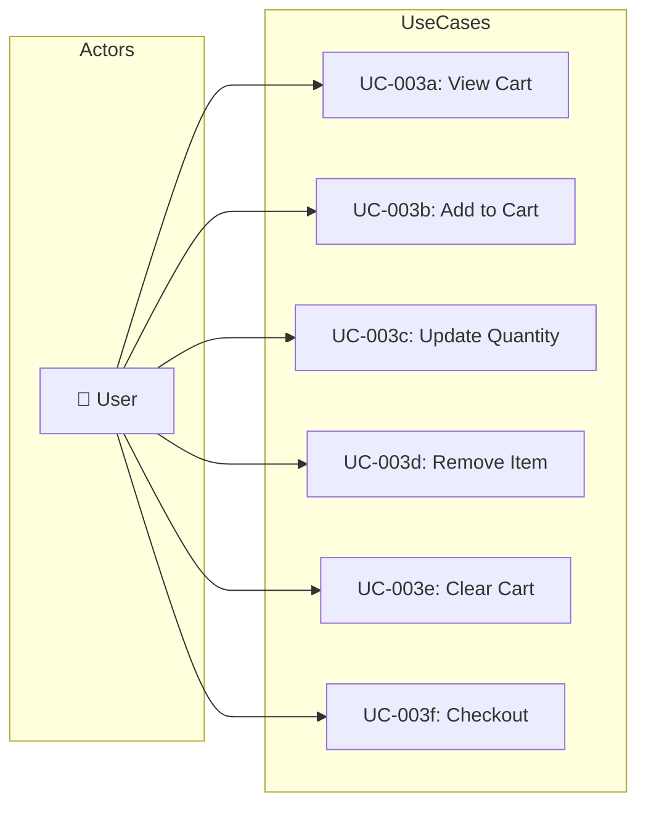

# UC-003: Shopping Cart

> **Use Case ID:** UC-003
> **Phiên bản:** 1.0.0
> **Ngày:** 2026-04-25
> **Actor:** User
> **Priority:** High

---

## 1. Mô tả

Cho phép User quản lý giỏ hàng: thêm sách vào giỏ, tăng/giảm số lượng, xóa sản phẩm, xem giỏ hàng và tiến hành checkout. Giỏ hàng là tài nguyên riêng của mỗi user.

---

## 2. Sub Use Cases

| ID | Tên | Actor |
|----|-----|-------|
| [UC-003a](./cart/uc-003a-view-cart.md) | View Cart | User |
| [UC-003b](./cart/uc-003b-add-to-cart.md) | Add Item to Cart | User |
| [UC-003c](./cart/uc-003c-update-quantity.md) | Update Quantity | User |
| [UC-003d](./cart/uc-003d-remove-item.md) | Remove Item | User |
| [UC-003e](./cart/uc-003e-clear-cart.md) | Clear Cart | User |
| [UC-003f](./cart/uc-003f-checkout.md) | Checkout | User |

---

## 3. Use Case Diagram

---

## 4. Related Documents

- **Sequence:** [seq-003a](./cart/seq-003a-view-cart.md), [seq-003b](./cart/seq-003b-add-to-cart.md), [seq-003c](./cart/seq-003c-update-quantity.md), [seq-003d](./cart/seq-003d-remove-item.md), [seq-003e](./cart/seq-003e-clear-cart.md), [seq-003f](./cart/seq-003f-checkout.md)

---

*Generated by Senior BA Agent | BookStore Backend | 2026-04-25*
