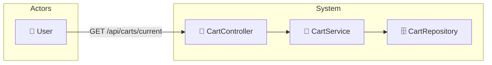

# UC-003a: View Cart

> **Use Case ID:** UC-003a
> **Parent:** UC-003 (Shopping Cart)
> **Phiên bản:** 1.0.0
> **Ngày:** 2026-04-25
> **Actor:** User
> **Priority:** High

---

## 1. Mô tả

Cho phép User xem giỏ hàng hiện tại của mình. Hệ thống sẽ tự động tạo giỏ hàng mới nếu user chưa có.

---

## 2. Use Case Diagram



---

## 3. Basic Flow

| Step | Actor | System | Action |
|------|-------|--------|--------|
| 1 | User | | Gửi `GET /api/carts/current` (cart của user hiện tại) |
| 2 | | CartController | Extract user từ JWT, gọi `cartService.getCartByCurrentUser()` |
| 3 | | CartService | Tìm Cart của user trong database |
| 4 | | | Nếu chưa có → tạo Cart mới |
| 5 | | | Trả về `CartResponse` (items + total price) |
| 6 | User | | Nhận thông tin giỏ hàng |

---

## 4. API Endpoint

```
GET /api/carts/current         (cart của user hiện tại)
GET /api/carts/users/{userId}  (cart của user cụ thể)
Auth: Cần đăng nhập
```

---

## 5. Alternative Flows

### 5.1 Cart Not Exists
- Khi user chưa có cart:
  - Hệ thống tự động tạo cart mới
  - Trả về empty cart

---

## 6. Data Model

### CartResponse
```json
{
  "id": 1,
  "userId": 1,
  "totalPrice": 500000.00,
  "items": [
    {
      "id": 1,
      "bookId": 5,
      "bookTitle": "Clean Code",
      "quantity": 2,
      "unitPrice": 250000.00,
      "totalPrice": 500000.00
    }
  ]
}
```

---

## 7. Preconditions

| Condition | Description |
|-----------|-------------|
| CP-001 | User phải đăng nhập |

---

## 8. Postconditions

| Condition | Description |
|-----------|-------------|
| PS-001 | User nhận được thông tin giỏ hàng |
| PS-002 | Nếu chưa có cart, cart mới được tạo |

---

## 9. Acceptance Criteria

| ID | Criteria | Test |
|----|----------|------|
| AC-001 | User có thể xem giỏ hàng của mình | `GET /api/carts/current` → 200 |
| AC-002 | Cart mới được tạo nếu chưa có | → CartResponse empty |
| AC-003 | Items có đầy đủ thông tin | Kiểm tra fields |

---

## 10. Related Documents

- **Sequence:** `seq-003a-view-cart.md`

---

*Generated by Senior BA Agent | BookStore Backend | 2026-04-25*
