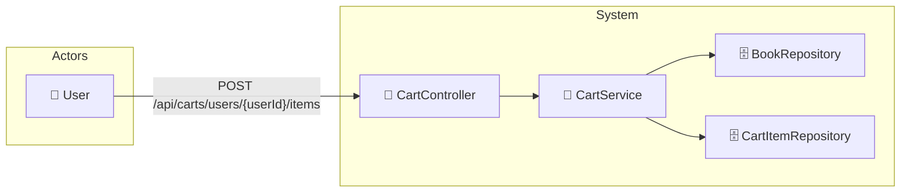

# UC-003b: Add Item to Cart

> **Use Case ID:** UC-003b
> **Parent:** UC-003 (Shopping Cart)
> **Phiên bản:** 1.0.0
> **Ngày:** 2026-04-25
> **Actor:** User
> **Priority:** High

---

## 1. Mô tả

Cho phép User thêm sách vào giỏ hàng. Nếu sách đã có trong giỏ, hệ thống sẽ tăng số lượng thay vì tạo item mới.

---

## 2. Use Case Diagram



---

## 3. Basic Flow

| Step | Actor | System | Action |
|------|-------|--------|--------|
| 1 | User | | Gửi `POST /api/carts/users/{userId}/items` |
| 2 | | CartController | Gọi `cartService.addToCart()` |
| 3 | | CartService | Tìm Cart của user |
| 4 | | BookRepository | Kiểm tra book có tồn tại |
| 5 | | CartItemRepository | Kiểm tra book đã có trong cart chưa |
| 6 | | | Nếu đã có → tăng quantity |
| 7 | | | Nếu chưa có → tạo CartItem mới |
| 8 | | | Tính lại total price của cart |
| 9 | | | Trả về updated CartResponse |
| 10 | User | | Nhận cart đã cập nhật |

---

## 4. API Endpoint

```
POST /api/carts/users/{userId}/items
Body: {
  "bookId": 5,
  "quantity": 2,
  "unitPrice": 250000.00
}
Auth: Cần đăng nhập
```

---

## 5. Alternative Flows

### 5.1 Book Not Found
- Khi bookId không tồn tại:
  - Trả về HTTP 400 "Book not found"

### 5.2 Unauthorized Access
- Khi userId trong path không khớp với user đang login:
  - Trả về HTTP 403 "Access denied"

### 5.3 Book Inactive
- Khi book tồn tại nhưng isActive = false:
  - Trả về HTTP 400 "Book is not available"

---

## 6. Data Model

### AddToCartRequest
```json
{
  "bookId": 5,
  "quantity": 2,
  "unitPrice": 250000.00
}
```

---

## 7. Business Rules

| Rule | Description |
|------|-------------|
| BR-001 | Mỗi user có đúng 1 Cart (1:1 relationship) |
| BR-002 | CartItem lưu `unitPrice` tại thời điểm thêm vào |
| BR-003 | Thêm book đã có → tăng quantity |

---

## 8. Preconditions

| Condition | Description |
|-----------|-------------|
| CP-001 | User phải đăng nhập |
| CP-002 | Book phải tồn tại và isActive = true |

---

## 9. Postconditions

| Condition | Description |
|-----------|-------------|
| PS-001 | Cart.totalPrice được cập nhật |
| PS-002 | CartItem được thêm hoặc quantity tăng |

---

## 10. Acceptance Criteria

| ID | Criteria | Test |
|----|----------|------|
| AC-001 | User có thể thêm book vào giỏ | → 201 Created |
| AC-002 | Thêm book đã có → tăng quantity | quantity tăng |
| AC-003 | Book không tồn tại bị từ chối | → 400 |

---

## 11. Related Documents

- **Sequence:** `seq-003b-add-to-cart.md`

---

*Generated by Senior BA Agent | BookStore Backend | 2026-04-25*
