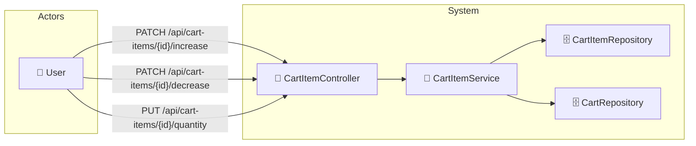

# UC-003c: Update Quantity

> **Use Case ID:** UC-003c
> **Parent:** UC-003 (Shopping Cart)
> **Phiên bản:** 1.0.0
> **Ngày:** 2026-04-25
> **Actor:** User
> **Priority:** High

---

## 1. Mô tả

Cho phép User tăng, giảm hoặc cập nhật trực tiếp số lượng sản phẩm trong giỏ hàng.

---

## 2. Use Case Diagram



---

## 3. Basic Flow

### 3.1 Increase Quantity

| Step | Actor | System | Action |
|------|-------|--------|--------|
| 1 | User | | Gửi `PATCH /api/cart-items/{cartItemId}/increase` |
| 2 | | CartItemController | Gọi `cartItemService.increaseQuantity()` |
| 3 | | CartItemService | Tăng quantity +1 |
| 4 | | | Tính lại cart total price |
| 5 | | | Trả về updated CartResponse |
| 6 | User | | Nhận cart đã cập nhật |

### 3.2 Decrease Quantity

| Step | Actor | System | Action |
|------|-------|--------|--------|
| 1 | User | | Gửi `PATCH /api/cart-items/{cartItemId}/decrease` |
| 2 | | CartItemController | Gọi `cartItemService.decreaseQuantity()` |
| 3 | | CartItemService | Giảm quantity -1 |
| 4 | | | Nếu quantity = 0 → xóa CartItem |
| 5 | | | Tính lại cart total price |
| 6 | | | Trả về updated CartResponse |
| 7 | User | | Nhận cart đã cập nhật |

### 3.3 Set Quantity (Direct Update)

| Step | Actor | System | Action |
|------|-------|--------|--------|
| 1 | User | | Gửi `PUT /api/cart-items/{cartItemId}/quantity` |
| 2 | | CartItemController | Gọi `cartItemService.updateQuantity()` |
| 3 | | CartItemService | Cập nhật quantity theo giá trị mới |
| 4 | | | Nếu quantity = 0 → xóa CartItem |
| 5 | | | Tính lại cart total price |
| 6 | | | Trả về updated CartResponse |
| 7 | User | | Nhận cart đã cập nhật |

---

## 4. API Endpoints

```
PATCH /api/cart-items/{cartItemId}/increase
PATCH /api/cart-items/{cartItemId}/decrease
PUT /api/cart-items/{cartItemId}/quantity
Body: { "quantity": 5 }
Auth: Cần đăng nhập
```

---

## 5. Alternative Flows

### 5.1 Decrease to Zero
- Khi giảm quantity xuống 0:
  - Tự động xóa CartItem
  - Không trả về error

### 5.2 Set Quantity to Zero
- Khi đặt quantity = 0:
  - Tự động xóa CartItem

### 5.3 CartItem Not Found
- Khi cartItemId không tồn tại:
  - Trả về HTTP 404 "Cart item not found"

### 5.4 Unauthorized Access
- Khi cartItem không thuộc user đang login:
  - Trả về HTTP 403 "Access denied"

---

## 6. Preconditions

| Condition | Description |
|-----------|-------------|
| CP-001 | User phải đăng nhập |
| CP-002 | CartItem phải tồn tại |
| CP-003 | CartItem phải thuộc về cart của user |

---

## 7. Postconditions

| Condition | Description |
|-----------|-------------|
| PS-001 | CartItem.quantity được cập nhật |
| PS-002 | Cart.totalPrice được cập nhật |
| PS-003 | Nếu quantity = 0, CartItem bị xóa |

---

## 8. Acceptance Criteria

| ID | Criteria | Test |
|----|----------|------|
| AC-001 | Tăng quantity hoạt động đúng | → +1 |
| AC-002 | Giảm quantity hoạt động đúng | → -1 |
| AC-003 | Giảm về 0 → xóa item | → item removed |
| AC-004 | Set quantity = 0 → xóa item | → item removed |

---

## 9. Related Documents

- **Sequence:** `seq-003c-update-quantity.md`

---

*Generated by Senior BA Agent | BookStore Backend | 2026-04-25*
