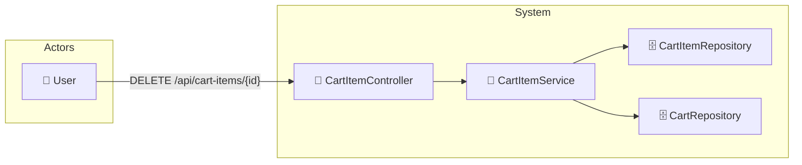

# UC-003d: Remove Item

> **Use Case ID:** UC-003d
> **Parent:** UC-003 (Shopping Cart)
> **Phiên bản:** 1.0.0
> **Ngày:** 2026-04-25
> **Actor:** User
> **Priority:** High

---

## 1. Mô tả

Cho phép User xóa một sản phẩm khỏi giỏ hàng.

---

## 2. Use Case Diagram



---

## 3. Basic Flow

| Step | Actor | System | Action |
|------|-------|--------|--------|
| 1 | User | | Gửi `DELETE /api/cart-items/{cartItemId}` |
| 2 | | CartItemController | Gọi `cartItemService.removeItem()` |
| 3 | | CartItemService | Tìm CartItem |
| 4 | | CartItemRepository | Xóa CartItem khỏi DB |
| 5 | | | Tính lại cart total price |
| 6 | | CartRepository | Lưu cart với totalPrice mới |
| 7 | | | Trả về HTTP 204 |
| 8 | User | | Nhận xác nhận đã xóa |

---

## 4. API Endpoint

```
DELETE /api/cart-items/{cartItemId}
Auth: Cần đăng nhập
```

---

## 5. Alternative Flows

### 5.1 CartItem Not Found
- Khi cartItemId không tồn tại:
  - Trả về HTTP 404 "Cart item not found"

### 5.2 Unauthorized Access
- Khi cartItem không thuộc user đang login:
  - Trả về HTTP 403 "Access denied"

---

## 6. Preconditions

| Condition | Description |
|-----------|-------------|
| CP-001 | User phải đăng nhập |
| CP-002 | CartItem phải tồn tại |

---

## 7. Postconditions

| Condition | Description |
|-----------|-------------|
| PS-001 | CartItem bị xóa khỏi database |
| PS-002 | Cart.totalPrice được cập nhật |

---

## 8. Acceptance Criteria

| ID | Criteria | Test |
|----|----------|------|
| AC-001 | Xóa item hoạt động | → 204 No Content |
| AC-002 | Cart total price được cập nhật | Kiểm tra giảm đúng |
| AC-003 | Item đã xóa không còn trong cart | → not in list |

---

## 9. Related Documents

- **Sequence:** `seq-003d-remove-item.md`

---

*Generated by Senior BA Agent | BookStore Backend | 2026-04-25*
