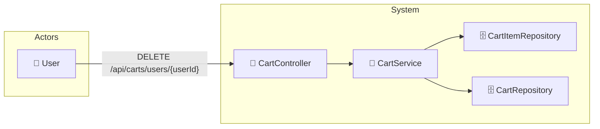

# UC-003e: Clear Cart

> **Use Case ID:** UC-003e
> **Parent:** UC-003 (Shopping Cart)
> **Phiên bản:** 1.0.0
> **Ngày:** 2026-04-25
> **Actor:** User
> **Priority:** Medium

---

## 1. Mô tả

Cho phép User xóa toàn bộ sản phẩm trong giỏ hàng.

---

## 2. Use Case Diagram



---

## 3. Basic Flow

| Step | Actor | System | Action |
|------|-------|--------|--------|
| 1 | User | | Gửi `DELETE /api/carts/users/{userId}` |
| 2 | | CartController | Gọi `cartService.clearCart()` |
| 3 | | CartService | Xóa tất cả CartItems của cart |
| 4 | | CartItemRepository | Delete all items |
| 5 | | | Đặt totalPrice = 0 |
| 6 | | CartRepository | Lưu cart |
| 7 | | | Trả về HTTP 204 |
| 8 | User | | Nhận xác nhận đã xóa |

---

## 4. API Endpoint

```
DELETE /api/carts/users/{userId}
Auth: Cần đăng nhập
```

---

## 5. Alternative Flows

### 5.1 Unauthorized Access
- Khi userId trong path không khớp với user đang login:
  - Trả về HTTP 403 "Access denied"

### 5.2 Cart Not Found
- Khi cart không tồn tại:
  - Trả về HTTP 404 "Cart not found"

---

## 6. Preconditions

| Condition | Description |
|-----------|-------------|
| CP-001 | User phải đăng nhập |
| CP-002 | Cart phải tồn tại |

---

## 7. Postconditions

| Condition | Description |
|-----------|-------------|
| PS-001 | Tất cả CartItems bị xóa |
| PS-002 | Cart.totalPrice = 0 |

---

## 8. Acceptance Criteria

| ID | Criteria | Test |
|----|----------|------|
| AC-001 | Clear cart xóa tất cả items | → empty |
| AC-002 | Cart total price = 0 | Kiểm tra = 0 |
| AC-003 | Clear cart empty cart vẫn OK | → 204 |

---

## 9. Related Documents

- **Sequence:** `seq-003e-clear-cart.md`

---

*Generated by Senior BA Agent | BookStore Backend | 2026-04-25*
