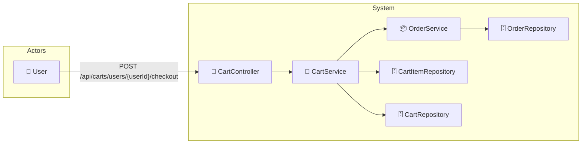

# UC-003f: Checkout

> **Use Case ID:** UC-003f
> **Parent:** UC-003 (Shopping Cart)
> **Phiên bản:** 1.0.0
> **Ngày:** 2026-04-25
> **Actor:** User
> **Priority:** Critical

---

## 1. Mô tả

Cho phép User tiến hành checkout từ giỏ hàng. Hệ thống sẽ tạo đơn hàng mới từ các items trong giỏ hàng.

---

## 2. Use Case Diagram



---

## 3. Basic Flow

| Step | Actor | System | Action |
|------|-------|--------|--------|
| 1 | User | | Gửi `POST /api/carts/users/{userId}/checkout` |
| 2 | | CartController | Gọi `cartService.checkout()` |
| 3 | | CartService | Tìm Cart của user |
| 4 | | CartItemRepository | Lấy tất cả CartItems |
| 5 | | CartService | Kiểm tra cart không trống |
| 6 | | OrderService | Tạo Order entity (status = UNPAID) |
| 7 | | OrderRepository | Lưu Order |
| 8 | | | Tạo OrderDetails từ CartItems |
| 9 | | CartItemRepository | Xóa CartItems sau khi tạo order |
| 10 | | CartRepository | Đặt totalPrice = 0 |
| 11 | | | Trả về OrderResponse |
| 12 | User | | Nhận order mới tạo, tiếp tục thanh toán |

---

## 4. API Endpoint

```
POST /api/carts/users/{userId}/checkout
Auth: Cần đăng nhập
```

---

## 5. Alternative Flows

### 5.1 Checkout - Empty Cart
- Khi cart trống:
  - Trả về HTTP 400 "Cart is empty"

### 5.2 Checkout - Out of Stock
- Khi không đủ stock:
  - Trả về HTTP 400 "Insufficient stock for some items"

### 5.3 Unauthorized Access
- Khi userId không khớp với user đang login:
  - Trả về HTTP 403 "Access denied"

---

## 6. Data Model

### OrderResponse
```json
{
  "id": 1,
  "orderDate": "2026-04-25T10:30:00",
  "totalAmount": 500000.00,
  "status": "UNPAID",
  "paymentMethod": null,
  "user": {
    "id": 1,
    "name": "Nguyen Van A"
  },
  "orderDetails": [
    {
      "id": 1,
      "bookId": 5,
      "bookTitle": "Clean Code",
      "quantity": 2,
      "priceAtPurchase": 250000.00
    }
  ]
}
```

---

## 7. Business Rules

| Rule | Description |
|------|-------------|
| BR-001 | Checkout chuyển CartItems → OrderDetails |
| BR-002 | CartItems bị xóa sau khi checkout |
| BR-003 | Order được tạo với status = UNPAID |

---

## 8. Preconditions

| Condition | Description |
|-----------|-------------|
| CP-001 | User phải đăng nhập |
| CP-002 | Cart phải có ít nhất 1 item |

---

## 9. Postconditions

| Condition | Description |
|-----------|-------------|
| PS-001 | Order mới được tạo |
| PS-002 | OrderDetails được tạo từ CartItems |
| PS-003 | CartItems bị xóa |
| PS-004 | Cart.totalPrice = 0 |

---

## 10. Acceptance Criteria

| ID | Criteria | Test |
|----|----------|------|
| AC-001 | Checkout tạo order thành công | → OrderResponse |
| AC-002 | Cart items bị xóa sau checkout | → empty |
| AC-003 | Cart empty không thể checkout | → 400 |
| AC-004 | Order status = UNPAID | Kiểm tra |

---

## 11. Related Documents

- **Sequence:** `seq-003f-checkout.md`

---

*Generated by Senior BA Agent | BookStore Backend | 2026-04-25*
