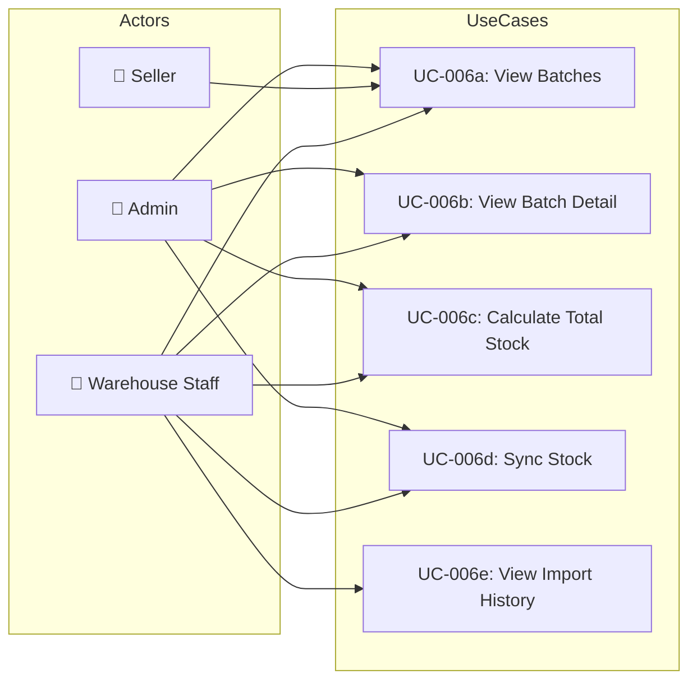

# UC-006: Inventory Management

> **Use Case ID:** UC-006
> **Phiên bản:** 1.0.0
> **Ngày:** 2026-04-25
> **Actor:** Warehouse Staff, Seller, Admin
> **Priority:** High

---

## 1. Mô tả

Quản lý tồn kho bao gồm xem batches, theo dõi lô hàng, xem lịch sử nhập kho, tính tổng stock theo sách, và đồng bộ stock quantity.

---

## 2. Sub Use Cases

| ID | Tên | Actor |
|----|-----|-------|
| [UC-006a](./inventory/uc-006a-view-batches.md) | View Batches | WS, Seller, Admin |
| [UC-006b](./inventory/uc-006b-view-batch-detail.md) | View Batch Detail | WS, Seller, Admin |
| [UC-006c](./inventory/uc-006c-calculate-total-stock.md) | Calculate Total Stock | WS, Seller, Admin |
| [UC-006d](./inventory/uc-006d-sync-stock.md) | Sync Stock | WS, Seller, Admin |
| [UC-006e](./inventory/uc-006e-view-import-history.md) | View Import History | WS, Seller, Admin |

---

## 3. Use Case Diagram

---

## 4. Related Documents

- **Sequence:** [seq-006a](./inventory/seq-006a-view-batches.md), [seq-006b](./inventory/seq-006b-view-batch-detail.md), [seq-006c](./inventory/seq-006c-calculate-total-stock.md), [seq-006d](./inventory/seq-006d-sync-stock.md), [seq-006e](./inventory/seq-006e-view-import-history.md)

---

*Generated by Senior BA Agent | BookStore Backend | 2026-04-25*
