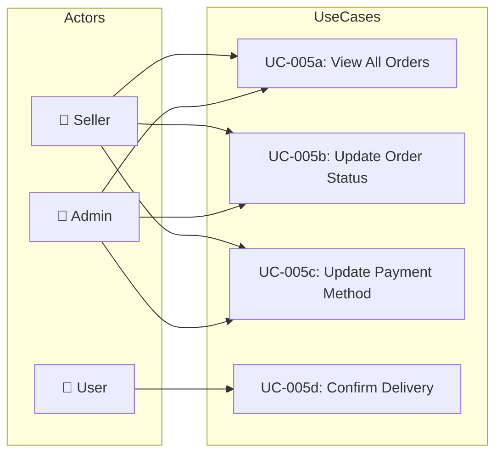

# UC-005: Order Management

> **Use Case ID:** UC-005
> **Phiên bản:** 1.0.0
> **Ngày:** 2026-04-25
> **Actor:** Seller, Admin
> **Priority:** High

---

## 1. Mô tả

Cho phép Seller và Admin quản lý đơn hàng: xác nhận đơn, cập nhật trạng thái (PROCESSING, DELIVERING), xác nhận giao hàng thành công, xem tất cả đơn hàng trong hệ thống.

---

## 2. Sub Use Cases

| ID | Tên | Actor |
|----|-----|-------|
| [UC-005a](./order-mgmt/uc-005a-view-all-orders.md) | View All Orders | Seller, Admin |
| [UC-005b](./order-mgmt/uc-005b-update-order-status.md) | Update Order Status | Seller, Admin |
| [UC-005c](./order-mgmt/uc-005c-update-payment-method.md) | Update Payment Method | Seller, Admin |
| [UC-005d](./order-mgmt/uc-005d-confirm-delivery.md) | Confirm Delivery | User, Seller |

---

## 3. Use Case Diagram

---

## 4. Related Documents

- **Sequence:** [seq-005a](./order-mgmt/seq-005a-view-all-orders.md), [seq-005b](./order-mgmt/seq-005b-update-order-status.md), [seq-005c](./order-mgmt/seq-005c-update-payment-method.md), [seq-005d](./order-mgmt/seq-005d-confirm-delivery.md)

---

*Generated by Senior BA Agent | BookStore Backend | 2026-04-25*
