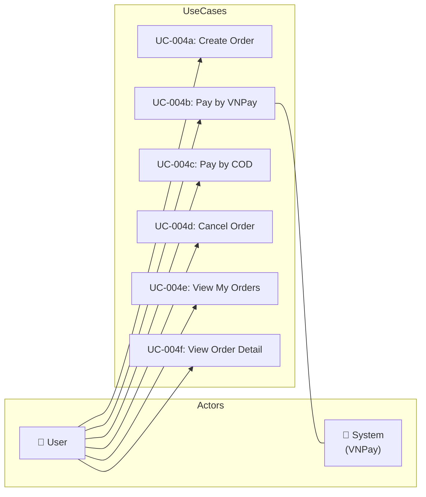
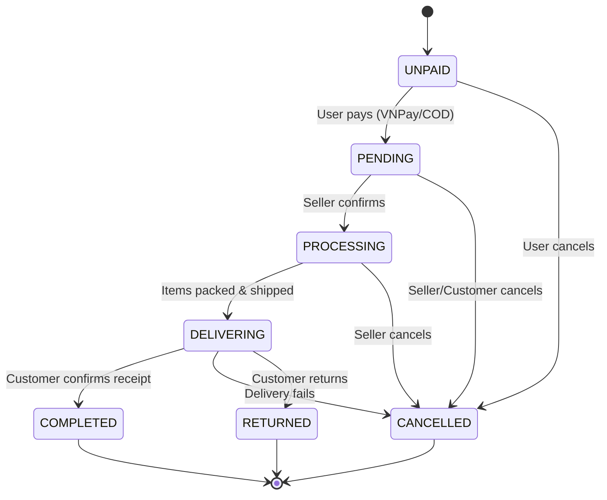

# UC-004: Place Order

> **Use Case ID:** UC-004
> **Phiên bản:** 1.0.0
> **Ngày:** 2026-04-25
> **Actor:** User
> **Priority:** Critical

---

## 1. Mô tả

Cho phép User đặt hàng với các phương thức thanh toán VNPay hoặc COD. Sau khi tạo đơn hàng, hệ thống hỗ trợ theo dõi trạng thái đơn hàng và xử lý thanh toán.

---

## 2. Sub Use Cases

| ID | Tên | Actor |
|----|-----|-------|
| [UC-004a](./order/uc-004a-create-order.md) | Create Order | User |
| [UC-004b](./order/uc-004b-pay-by-vnpay.md) | Pay by VNPay | User |
| [UC-004c](./order/uc-004c-pay-by-cod.md) | Pay by COD | User |
| [UC-004d](./order/uc-004d-cancel-order.md) | Cancel Order | User |
| [UC-004e](./order/uc-004e-view-my-orders.md) | View My Orders | User |
| [UC-004f](./order/uc-004f-view-order-detail.md) | View Order Detail | User |

---

## 3. Use Case Diagram

---

## 4. Order Status Flow

---

## 5. Related Documents

- **Sequence:** [seq-004a](./order/seq-004a-create-order.md), [seq-004b](./order/seq-004b-pay-by-vnpay.md), [seq-004c](./order/seq-004c-pay-by-cod.md), [seq-004d](./order/seq-004d-cancel-order.md), [seq-004e](./order/seq-004e-view-my-orders.md), [seq-004f](./order/seq-004f-view-order-detail.md)

---

*Generated by Senior BA Agent | BookStore Backend | 2026-04-25*
