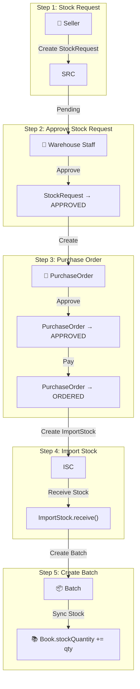

# UC-010: Procurement

> **Use Case ID:** UC-010
> **Phiên bản:** 1.0.0
> **Ngày:** 2026-04-25
> **Actor:** Seller, Warehouse Staff, Admin
> **Priority:** High

---

## 1. Mô tả

Quy trình mua hàng từ nhà cung cấp: tạo yêu cầu nhập hàng (StockRequest), tạo đơn đặt hàng (PurchaseOrder), nhập kho (ImportStock), và tạo lô hàng (Batch).

---

## 2. Sub Use Cases

| ID | Tên | Actor |
|----|-----|-------|
| [UC-010a](./procurement/uc-010a-create-stock-request.md) | Create Stock Request | Seller |
| [UC-010b](./procurement/uc-010b-approve-reject-stock-request.md) | Approve/Reject Stock Request | Warehouse Staff |
| [UC-010c](./procurement/uc-010c-create-purchase-order.md) | Create Purchase Order | Warehouse Staff |
| [UC-010d](./procurement/uc-010d-approve-pay-purchase-order.md) | Approve & Pay Purchase Order | WS, Admin |
| [UC-010e](./procurement/uc-010e-create-import-stock.md) | Create Import Stock | Warehouse Staff |
| [UC-010f](./procurement/uc-010f-receive-stock.md) | Receive Stock (Create Batch) | Warehouse Staff |

---

## 3. Full Procurement Flow

---

## 4. Related Documents

- **Sequence:** [seq-010a](./procurement/seq-010a-create-stock-request.md), [seq-010b](./procurement/seq-010b-approve-reject-stock-request.md), [seq-010c](./procurement/seq-010c-create-purchase-order.md), [seq-010d](./procurement/seq-010d-approve-pay-purchase-order.md), [seq-010e](./procurement/seq-010e-create-import-stock.md), [seq-010f](./procurement/seq-010f-receive-stock.md)

---

*Generated by Senior BA Agent | BookStore Backend | 2026-04-25*
