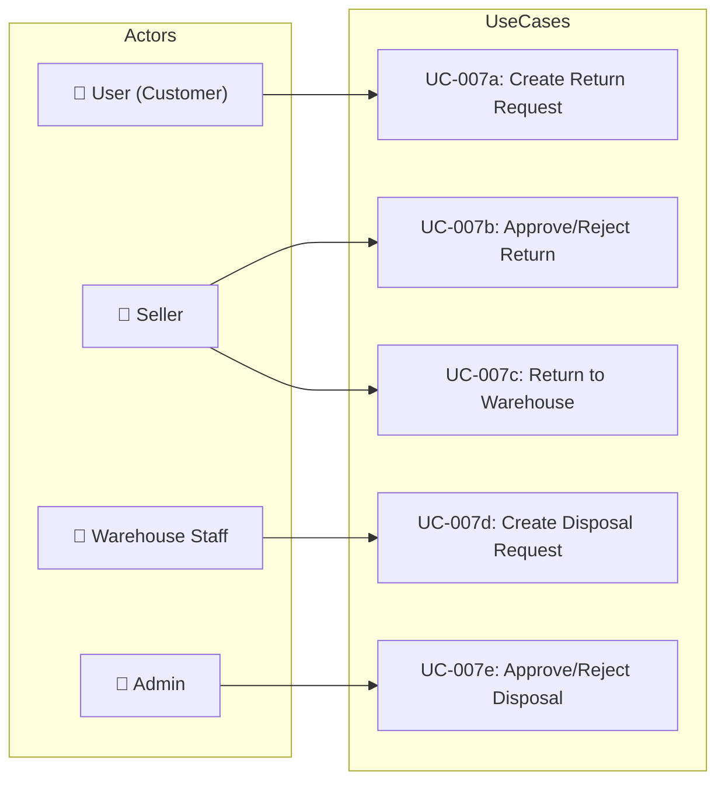

# UC-007: Return & Disposal

> **Use Case ID:** UC-007
> **Phiên bản:** 1.0.0
> **Ngày:** 2026-04-25
> **Actor:** User, Seller, Warehouse Staff, Admin
> **Priority:** Medium

---

## 1. Mô tả

Xử lý các yêu cầu trả hàng của khách, thanh lý hàng hỏng, và quản lý hàng trả lại về kho từ seller.

---

## 2. Sub Use Cases

| ID | Tên | Actor |
|----|-----|-------|
| [UC-007a](./return/uc-007a-create-return-request.md) | Create Return Request | User |
| [UC-007b](./return/uc-007b-approve-reject-return.md) | Approve/Reject Return | Seller |
| [UC-007c](./return/uc-007c-return-to-warehouse.md) | Return to Warehouse | Seller |
| [UC-007d](./return/uc-007d-create-disposal-request.md) | Create Disposal Request | Warehouse Staff |
| [UC-007e](./return/uc-007e-approve-reject-disposal.md) | Approve/Reject Disposal | Admin |

---

## 3. Use Case Diagram

---

## 4. Related Documents

- **Sequence:** [seq-007a](./return/seq-007a-create-return-request.md), [seq-007b](./return/seq-007b-approve-reject-return.md), [seq-007c](./return/seq-007c-return-to-warehouse.md), [seq-007d](./return/seq-007d-create-disposal-request.md), [seq-007e](./return/seq-007e-approve-reject-disposal.md)

---

*Generated by Senior BA Agent | BookStore Backend | 2026-04-25*
