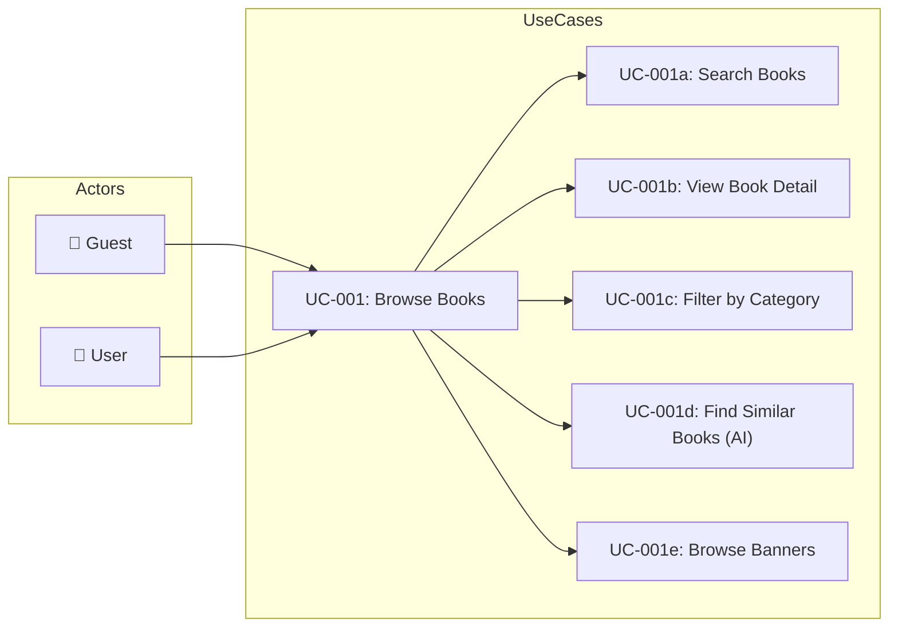
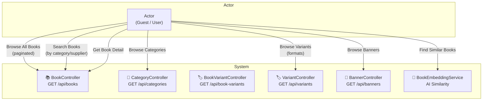

# UC-001: Browse Books

> **Use Case ID:** UC-001
> **Phiên bản:** 1.0.0
> **Ngày:** 2026-04-25
> **Actor:** Guest, User
> **Priority:** High

---

## 1. Mô tả

Cho phép người dùng (đã đăng nhập hoặc chưa) duyệt, tìm kiếm và xem chi tiết sách trong hệ thống. Đây là use case cốt lõi giúp người dùng khám phá sản phẩm.

---

## 2. Use Case Diagram



---

## 3. Actor-System Interaction



---

## 4. Basic Flow

### 4.1 Browse All Books (Paginated)

| Step | Actor | System | Action |
|------|-------|--------|--------|
| 1 | Guest/User | | Gửi `GET /api/books?page=1&size=10&sortBy=id&sortDir=asc` |
| 2 | | BookController | Nhận request, chuyển sang BookService |
| 3 | | BookService | Gọi repository tìm tất cả books (paginated) |
| 4 | | | Trả về `PageResponse<BookResponse>` |
| 5 | Guest/User | | Nhận danh sách books với pagination |

**API Endpoint:**
```
GET /api/books
Query Params: page (default: 1), size (default: 10), sortBy (default: id), sortDir (asc/desc)
Auth: Không cần (public)
```

### 4.2 Get All Books Without Pagination

| Step | Actor | System | Action |
|------|-------|--------|--------|
| 1 | Guest/User | | Gửi `GET /api/books/all` |
| 2 | | BookController | Gọi `bookService.getAllBooks()` |
| 3 | | | Trả về `List<BookResponse>` |
| 4 | Guest/User | | Nhận full list |

### 4.3 Get All Books Sorted

| Step | Actor | System | Action |
|------|-------|--------|--------|
| 1 | Guest/User | | Gửi `GET /api/books/sorted?sortByField=price&sortDirection=desc` |
| 2 | | BookController | Gọi `bookService.getAllBooksSorted(sortByField, sortDirection)` |
| 3 | | | Trả về sorted list |
| 4 | Guest/User | | Nhận sorted list |

### 4.4 Get Books by Category

| Step | Actor | System | Action |
|------|-------|--------|--------|
| 1 | Guest/User | | Gửi `GET /api/books/category/{categoryId}` |
| 2 | | BookController | Gọi `bookService.getBooksByCategoryId(categoryId)` |
| 3 | | | Trả về books thuộc category |
| 4 | Guest/User | | Nhận danh sách books theo category |

### 4.5 Get Books by Supplier

| Step | Actor | System | Action |
|------|-------|--------|--------|
| 1 | Guest/User | | Gửi `GET /api/books/supplier/{supplierId}` |
| 2 | | BookController | Gọi `bookService.getBooksBySupplierId(supplierId)` |
| 3 | | | Trả về books từ supplier |
| 4 | Guest/User | | Nhận danh sách books theo supplier |

### 4.6 Get Book Detail

| Step | Actor | System | Action |
|------|-------|--------|--------|
| 1 | Guest/User | | Gửi `GET /api/books/{bookId}` |
| 2 | | BookController | Gọi `bookService.getBookById(bookId)` |
| 3 | | BookService | Tìm book, map sang BookResponse |
| 4 | | | Trả về book detail (bao gồm variants, categories) |
| 5 | Guest/User | | Nhận chi tiết book |

### 4.7 Find Similar Books (AI)

| Step | Actor | System | Action |
|------|-------|--------|--------|
| 1 | User | | Gửi `GET /api/books/{bookId}/similar?limit=10` |
| 2 | | BookController | Chuyển sang BookEmbeddingService |
| 3 | | BookEmbeddingService | Tìm book embedding, tính similarity |
| 4 | | | Trả về danh sách similar books |
| 5 | User | | Nhận gợi ý sách tương tự |

### 4.8 Browse Categories

| Step | Actor | System | Action |
|------|-------|--------|--------|
| 1 | Guest/User | | Gửi `GET /api/categories` |
| 2 | | CategoryController | Gọi CategoryService.getAllCategories() |
| 3 | | | Trả về danh sách categories |
| 4 | Guest/User | | Nhận danh sách thể loại |

### 4.9 Browse Variants (Formats)

| Step | Actor | System | Action |
|------|-------|--------|--------|
| 1 | Guest/User | | Gửi `GET /api/variants` hoặc `GET /api/variants/book/{bookId}` |
| 2 | | VariantController | Gọi VariantService |
| 3 | | | Trả về danh sách variants |
| 4 | Guest/User | | Nhận định dạng sách |

### 4.10 Browse Banners

| Step | Actor | System | Action |
|------|-------|--------|--------|
| 1 | Guest/User | | Gửi `GET /api/banners` |
| 2 | | BannerController | Gọi BannerService |
| 3 | | | Trả về danh sách banners |
| 4 | Guest/User | | Nhận danh sách banners (homepage) |

---

## 5. Alternative Flows

### 5.1 Book Not Found
- Khi `GET /api/books/{bookId}` không tìm thấy book:
  - Hệ thống ném `IdInvalidException`
  - Trả về HTTP 400 với message "Book not found"

### 5.2 Empty Result
- Khi không có book nào phù hợp:
  - Trả về empty list `[]`
  - HTTP 200

---

## 6. Data Model

### BookResponse Fields
```json
{
  "id": 1,
  "title": "Clean Code",
  "author": "Robert C. Martin",
  "description": "...",
  "publicationYear": 2008,
  "weightGrams": 500,
  "pageCount": 431,
  "price": 250000.00,
  "stockQuantity": 50,
  "imageUrl": "https://...",
  "isActive": true,
  "categories": [...],
  "variants": [...],
  "supplier": {...}
}
```

---

## 7. Preconditions

| Condition | Description |
|-----------|-------------|
| CP-001 | Không cần đăng nhập (public API) |
| CP-002 | Database phải có ít nhất 1 book |

---

## 8. Postconditions

| Condition | Description |
|-----------|-------------|
| PS-001 | Actor nhận được danh sách books đã được paginated/sorted |
| PS-002 | Actor nhận được chi tiết đầy đủ của 1 book |

---

## 9. Business Rules

| Rule | Description |
|------|-------------|
| BR-001 | Chỉ books có `isActive = true` mới hiển thị |
| BR-002 | Pagination default: page=1, size=10 |
| BR-003 | Sort direction: `asc` hoặc `desc` |

---

## 10. Related Documents

- **Sequence:** `sequence/seq-001.md`
- **Class Diagram:** `class-diagram/class-001-catalog.md`
- **ER Diagram:** `er-diagram/er-001-full.md`

---

## 11. Acceptance Criteria

| ID | Criteria | Test |
|----|----------|------|
| AC-001 | Guest có thể browse all books mà không cần đăng nhập | `GET /api/books` → 200 |
| AC-002 | Books được paginated đúng | Response có `page`, `size`, `totalElements` |
| AC-003 | Có thể sort theo bất kỳ field nào | `?sortBy=price&sortDir=desc` |
| AC-004 | Có thể filter theo category | `GET /api/books/category/1` |
| AC-005 | Similar books trả về đúng số lượng | `?limit=5` → 5 books |
| AC-006 | Book not found trả về error | `GET /api/books/999` → 400 |

---

*Generated by Senior BA Agent | BookStore Backend | 2026-04-25*
