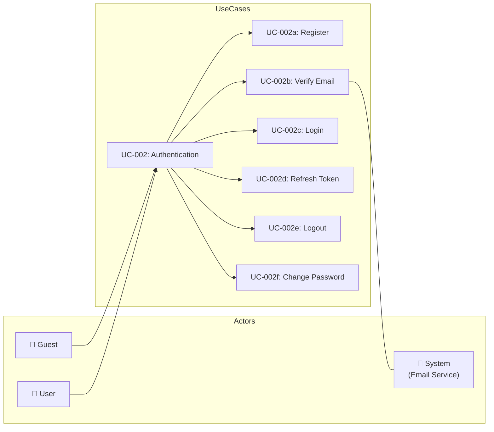
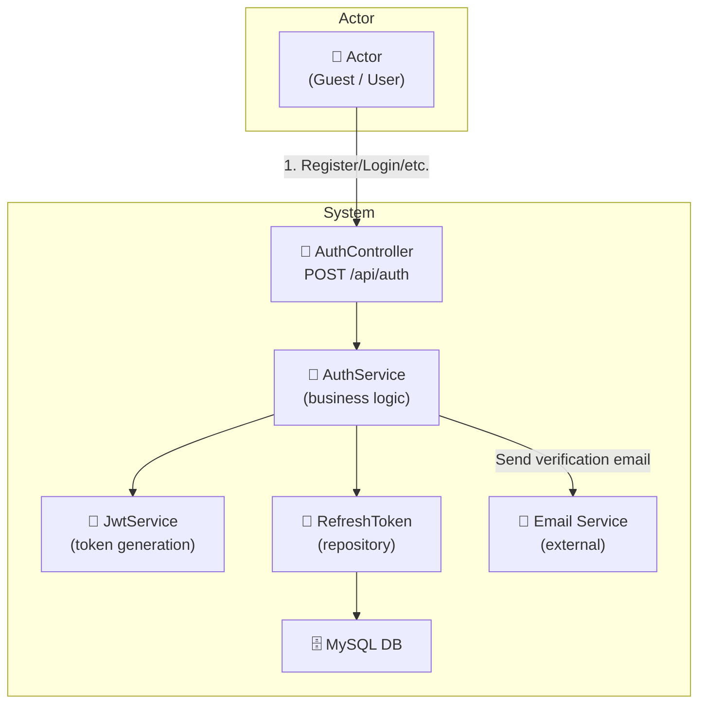

# UC-002: Authentication

> **Use Case ID:** UC-002
> **Phiên bản:** 1.0.0
> **Ngày:** 2026-04-25
> **Actor:** Guest, User
> **Priority:** Critical

---

## 1. Mô tả

Quản lý xác thực người dùng bao gồm đăng ký tài khoản mới, xác thực email, đăng nhập, đăng xuất, refresh token, và đổi mật khẩu. Đây là use case nền tảng cho toàn bộ hệ thống.

---

## 2. Use Case Diagram



---

## 3. Actor-System Interaction



---

## 4. Basic Flow

### 4.1 Register (Đăng ký)

| Step | Actor | System | Action |
|------|-------|--------|--------|
| 1 | Guest | | Gửi `POST /api/auth/register` với thông tin tài khoản |
| 2 | | AuthController | Validate request, chuyển sang AuthService |
| 3 | | AuthService | Tạo User entity, hash password |
| 4 | | | Tạo VerificationToken gửi email |
| 5 | | Email | Gửi email xác thực cho user |
| 6 | | | Trả về `RegisterResponse` |
| 7 | Guest | | Nhận response (chưa active) |

**API Endpoint:**
```
POST /api/auth/register
Body: { "email", "password", "firstName", "lastName", "phoneNumber" }
Auth: Không cần (public)
```

### 4.2 Verify Email (Xác thực email)

| Step | Actor | System | Action |
|------|-------|--------|--------|
| 1 | User | | Click link trong email: `GET /api/auth/verify?token=xxx&userId=1` |
| 2 | | AuthController | Gọi `authService.verifyEmailTokenForUser()` |
| 3 | | AuthService | Tìm VerificationToken, kiểm tra expiry |
| 4 | | | Cập nhật User `isActive = true` |
| 5 | | | Xóa VerificationToken |
| 6 | User | | Nhận HTTP 204 (no content) - email verified |

**API Endpoints:**
```
GET /api/auth/verify?token={token}&userId={userId}
POST /api/auth/verify/{userId}  (body: { "verifyToken" })
```

### 4.3 Login (Đăng nhập)

| Step | Actor | System | Action |
|------|-------|--------|--------|
| 1 | Guest | | Gửi `POST /api/auth/login` với email + password |
| 2 | | AuthController | Gọi `authService.login()` |
| 3 | | AuthService | Tìm user theo email |
| 4 | | | Kiểm tra password hash |
| 5 | | | Tạo Access Token (JWT) |
| 6 | | | Tạo Refresh Token, lưu vào DB |
| 7 | | | Trả về `AuthenticationResponse` (access + refresh token) |
| 8 | Guest | | Nhận tokens, lưu vào client |

**API Endpoint:**
```
POST /api/auth/login
Body: { "email", "password" }
Auth: Không cần (public)
```

### 4.4 Refresh Token

| Step | Actor | System | Action |
|------|-------|--------|--------|
| 1 | User | | Gửi `POST /api/auth/refresh` với refresh token |
| 2 | | AuthController | Gọi `authService.refreshToken()` |
| 3 | | AuthService | Kiểm tra refresh token còn valid |
| 4 | | | Tạo access token mới |
| 5 | | | Trả về `RefreshTokenResponse` |
| 6 | User | | Nhận access token mới |

### 4.5 Logout (Đăng xuất)

| Step | Actor | System | Action |
|------|-------|--------|--------|
| 1 | User | | Gửi `POST /api/auth/logout` với refresh token |
| 2 | | AuthController | Gọi `authService.logout()` |
| 3 | | AuthService | Tìm RefreshToken trong DB |
| 4 | | | Đặt `revoked = true` |
| 5 | | | Trả về HTTP 204 |
| 6 | User | | Xóa tokens khỏi client |

### 4.6 Change Password (Đổi mật khẩu)

| Step | Actor | System | Action |
|------|-------|--------|--------|
| 1 | User | | Gửi `POST /api/auth/change-password` |
| 2 | | AuthController | Validate request |
| 3 | | AuthService | Xác thực mật khẩu cũ |
| 4 | | | Hash mật khẩu mới |
| 5 | | | Cập nhật User.password |
| 6 | | | Trả về HTTP 204 |

---

## 5. Alternative Flows

### 5.1 Register - Email Already Exists
- Nếu email đã tồn tại:
  - Trả về HTTP 400 "Email already exists"

### 5.2 Login - Invalid Credentials
- Nếu email/password sai:
  - Trả về HTTP 401 "Invalid credentials"

### 5.3 Login - User Not Active
- Nếu user chưa verify email:
  - Trả về HTTP 403 "Please verify your email first"

### 5.4 Refresh Token - Expired/Revoked
- Nếu refresh token hết hạn hoặc bị revoke:
  - Trả về HTTP 401 "Token expired or revoked"

---

## 6. Data Model

### RegisterRequest
```json
{
  "email": "user@example.com",
  "password": "SecurePass123",
  "firstName": "Nguyen",
  "lastName": "Van A",
  "phoneNumber": "0912345678"
}
```

### AuthenticationResponse
```json
{
  "token": "eyJhbGciOiJIUzI1NiJ9...",
  "refreshToken": "dGhpcyBpcyBhIHJlZnJlc2ggdG9rZW4...",
  "tokenType": "Bearer",
  "expiresIn": 3600
}
```

---

## 7. Token Structure

### Access Token (JWT)
```json
{
  "sub": "user@example.com",
  "roles": ["ROLE_USER"],
  "iat": 1745539200,
  "exp": 1745542800
}
```

### Refresh Token
- Lưu trong `refresh_tokens` table
- Có expiry time (thường 7-30 ngày)
- Có flag `revoked` để hỗ trợ logout

---

## 8. Security Requirements

| Rule | Description |
|------|-------------|
| SR-001 | Password phải được hash trước khi lưu |
| SR-002 | JWT secret phải đủ dài (ít nhất 256 bits) |
| SR-003 | Refresh token phải được lưu trong DB để có thể revoke |
| SR-004 | VerificationToken phải có expiry time |
| SR-005 | Chỉ user đã verify mới được login |

---

## 9. Preconditions

| Condition | Description |
|-----------|-------------|
| CP-001 | Guest phải có email chưa tồn tại trong hệ thống |
| CP-002 | Email service phải được cấu hình đúng |

---

## 10. Postconditions

| Condition | Description |
|-----------|-------------|
| PS-001 | User mới được tạo với `isActive = false` |
| PS-002 | VerificationToken được tạo và gửi qua email |
| PS-003 | Sau khi verify: `isActive = true`, token bị xóa |

---

## 11. Related Documents

- **Sequence:** `sequence/seq-002.md`
- **Class Diagram:** `class-diagram/class-008-auth.md`
- **ER Diagram:** `er-diagram/er-001-full.md` (RefreshToken, VerificationToken, User)

---

## 12. Acceptance Criteria

| ID | Criteria | Test |
|----|----------|------|
| AC-001 | Guest có thể đăng ký tài khoản mới | `POST /api/auth/register` → 201 |
| AC-002 | Email xác thực được gửi sau đăng ký | Kiểm tra inbox email |
| AC-003 | User không thể login nếu chưa verify email | → 403 |
| AC-004 | User đã verify có thể login thành công | `POST /api/auth/login` → 200 |
| AC-005 | Refresh token hoạt động đúng | `POST /api/auth/refresh` → 200 |
| AC-006 | Logout revoke refresh token | Token không thể reuse |
| AC-007 | Đổi mật khẩu thành công | `POST /api/auth/change-password` → 204 |

---

*Generated by Senior BA Agent | BookStore Backend | 2026-04-25*
