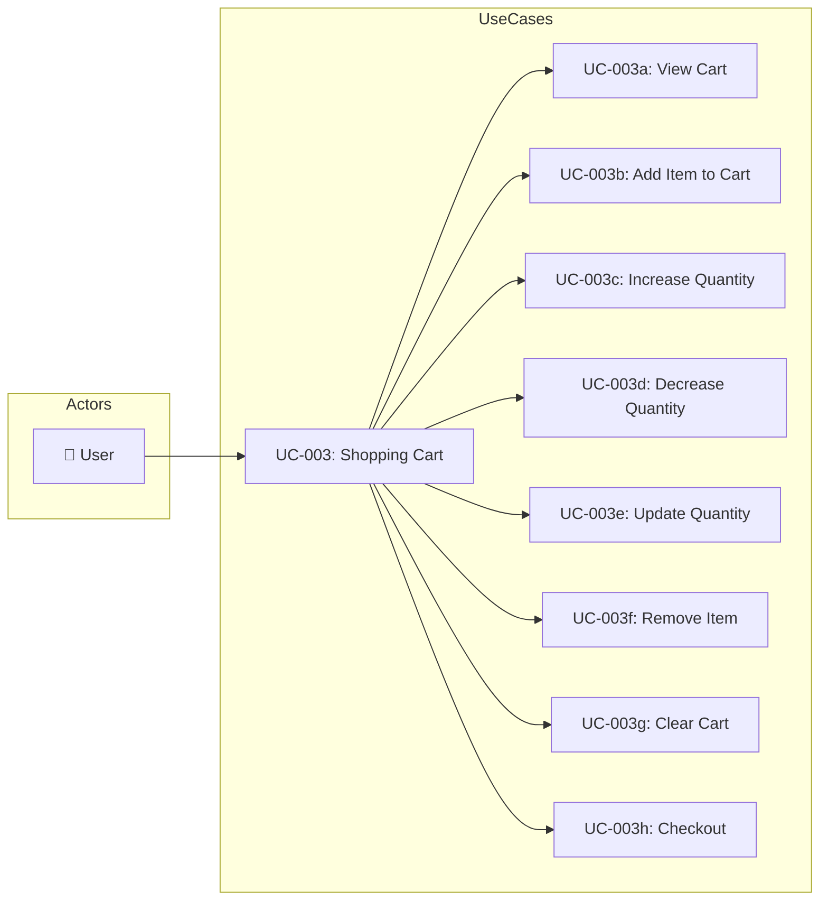
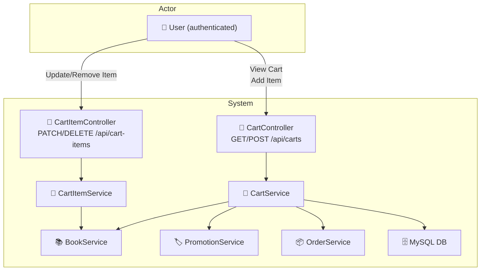

# UC-003: Shopping Cart

> **Use Case ID:** UC-003
> **Phiên bản:** 1.0.0
> **Ngày:** 2026-04-25
> **Actor:** User
> **Priority:** High

---

## 1. Mô tả

Cho phép User quản lý giỏ hàng: thêm sách vào giỏ, tăng/giảm số lượng, xóa sản phẩm, xem giỏ hàng và tiến hành checkout. Giỏ hàng là tài nguyên riêng của mỗi user.

---

## 2. Use Case Diagram



---

## 3. Actor-System Interaction



---

## 4. Basic Flow

### 4.1 View Cart (Xem giỏ hàng)

| Step | Actor | System | Action |
|------|-------|--------|--------|
| 1 | User | | Gửi `GET /api/carts/current` (cart của user hiện tại) |
| 2 | | CartController | Extract user từ JWT, gọi `cartService.getCartByCurrentUser()` |
| 3 | | CartService | Tìm hoặc tạo Cart cho user |
| 4 | | | Trả về `CartResponse` (items + total price) |
| 5 | User | | Nhận thông tin giỏ hàng |

**API Endpoint:**
```
GET /api/carts/current         (user hiện tại)
GET /api/carts/users/{userId}  (user cụ thể)
Auth: Cần đăng nhập
```

### 4.2 Add Item to Cart (Thêm vào giỏ)

| Step | Actor | System | Action |
|------|-------|--------|--------|
| 1 | User | | Gửi `POST /api/carts/users/{userId}/items` |
| 2 | | CartController | Gọi `cartService.addToCart()` |
| 3 | | CartService | Tìm Cart của user |
| 4 | | | Kiểm tra book có tồn tại không |
| 5 | | | Nếu book đã có trong cart → tăng quantity |
| 6 | | | Nếu book chưa có → tạo CartItem mới |
| 7 | | | Tính lại total price của cart |
| 8 | | | Trả về updated CartResponse |
| 9 | User | | Nhận cart đã cập nhật |

**API Endpoint:**
```
POST /api/carts/users/{userId}/items
Body: { "bookId", "quantity" (optional, default 1), "unitPrice" }
Auth: Cần đăng nhập
```

### 4.3 Increase Quantity (Tăng số lượng)

| Step | Actor | System | Action |
|------|-------|--------|--------|
| 1 | User | | Gửi `PATCH /api/cart-items/{cartItemId}/increase` |
| 2 | | CartItemController | Gọi `cartItemService.increaseQuantity()` |
| 3 | | CartItemService | Tăng quantity +1 |
| 4 | | | Tính lại cart total price |
| 5 | | | Trả về updated CartResponse |
| 6 | User | | Nhận cart đã cập nhật |

### 4.4 Decrease Quantity (Giảm số lượng)

| Step | Actor | System | Action |
|------|-------|--------|--------|
| 1 | User | | Gửi `PATCH /api/cart-items/{cartItemId}/decrease` |
| 2 | | CartItemController | Gọi `cartItemService.decreaseQuantity()` |
| 3 | | CartItemService | Giảm quantity -1 |
| 4 | | | Nếu quantity = 0 → xóa CartItem |
| 5 | | | Tính lại cart total price |
| 6 | | | Trả về updated CartResponse |
| 7 | User | | Nhận cart đã cập nhật |

### 4.5 Update Quantity (Cập nhật số lượng)

| Step | Actor | System | Action |
|------|-------|--------|--------|
| 1 | User | | Gửi `PUT /api/cart-items/{cartItemId}/quantity` |
| 2 | | CartItemController | Gọi `cartItemService.updateQuantity()` |
| 3 | | CartItemService | Cập nhật quantity theo giá trị mới |
| 4 | | | Tính lại cart total price |
| 5 | | | Trả về updated CartResponse |
| 6 | User | | Nhận cart đã cập nhật |

### 4.6 Remove Item (Xóa sản phẩm)

| Step | Actor | System | Action |
|------|-------|--------|--------|
| 1 | User | | Gửi `DELETE /api/cart-items/{cartItemId}` |
| 2 | | CartItemController | Gọi `cartItemService.removeItem()` |
| 3 | | CartItemService | Xóa CartItem khỏi DB |
| 4 | | | Tính lại cart total price |
| 5 | | | Trả về HTTP 204 |
| 6 | User | | Nhận xác nhận đã xóa |

### 4.7 Clear Cart (Xóa toàn bộ giỏ)

| Step | Actor | System | Action |
|------|-------|--------|--------|
| 1 | User | | Gửi `DELETE /api/carts/users/{userId}` |
| 2 | | CartController | Gọi `cartService.clearCart()` |
| 3 | | CartService | Xóa tất cả CartItems |
| 4 | | | Đặt totalPrice = 0 |
| 5 | | | Trả về HTTP 204 |
| 6 | User | | Nhận xác nhận đã xóa |

### 4.8 Checkout (Thanh toán)

| Step | Actor | System | Action |
|------|-------|--------|--------|
| 1 | User | | Gửi `GET /api/carts/current/checkout` (preview) |
| 2 | | CartController | Gọi `cartService.checkoutCurrentUser()` |
| 3 | | CartService | Lấy cart, tạo Order |
| 4 | | | Tạo OrderDetails từ CartItems |
| 5 | | | Xóa CartItems sau khi tạo order |
| 6 | | | Trả về OrderResponse |
| 7 | User | | Nhận order mới tạo |

---

## 5. Alternative Flows

### 5.1 Add Item - Book Not Found
- Khi bookId không tồn tại:
  - Trả về HTTP 400 "Book not found"

### 5.2 Add Item - Unauthorized
- Khi userId trong path không khớp với user đang login:
  - Trả về HTTP 403 "Access denied"

### 5.3 Decrease Quantity - Last Item
- Khi giảm quantity xuống 0:
  - Tự động xóa CartItem
  - Không trả về error

### 5.4 Checkout - Empty Cart
- Khi cart trống:
  - Trả về HTTP 400 "Cart is empty"

---

## 6. Data Model

### CartResponse
```json
{
  "id": 1,
  "userId": 1,
  "totalPrice": 500000.00,
  "items": [
    {
      "id": 1,
      "bookId": 5,
      "bookTitle": "Clean Code",
      "quantity": 2,
      "unitPrice": 250000.00,
      "totalPrice": 500000.00
    }
  ]
}
```

### AddToCartRequest
```json
{
  "bookId": 5,
  "quantity": 2,
  "unitPrice": 250000.00
}
```

---

## 7. Business Rules

| Rule | Description |
|------|-------------|
| BR-001 | Mỗi user có đúng 1 Cart (1:1 relationship) |
| BR-002 | CartItem lưu `unitPrice` tại thời điểm thêm vào |
| BR-003 | `totalPrice` của Cart = sum(`unitPrice * quantity`) của tất cả items |
| BR-004 | Quantity tối thiểu = 1; giảm xuống 0 = xóa item |
| BR-005 | Checkout chuyển CartItems → OrderDetails và xóa CartItems |

---

## 8. Preconditions

| Condition | Description |
|-----------|-------------|
| CP-001 | User phải đăng nhập |
| CP-002 | Book phải tồn tại và `isActive = true` |
| CP-003 | Cart đã tồn tại cho user (hoặc được tạo mới) |

---

## 9. Postconditions

| Condition | Description |
|-----------|-------------|
| PS-001 | Cart.totalPrice được cập nhật sau mỗi thao tác |
| PS-002 | Checkout tạo Order và xóa CartItems |

---

## 10. Related Documents

- **Sequence:** `sequence/seq-003.md`
- **Class Diagram:** `class-diagram/class-002-order.md`
- **ER Diagram:** `er-diagram/er-001-full.md`

---

## 11. Acceptance Criteria

| ID | Criteria | Test |
|----|----------|------|
| AC-001 | User có thể xem giỏ hàng của mình | `GET /api/carts/current` → 200 |
| AC-002 | User có thể thêm book vào giỏ | `POST /api/carts/users/1/items` → 201 |
| AC-003 | Thêm book đã có trong giỏ → tăng quantity | quantity tăng gấp đôi |
| AC-004 | Tăng/giảm quantity hoạt động đúng | PATCH increase → +1 |
| AC-005 | Giảm về 0 → xóa item | → item removed |
| AC-006 | Xóa item hoạt động | DELETE → 204 |
| AC-007 | Clear cart xóa tất cả items | DELETE cart → empty |
| AC-008 | Checkout tạo order thành công | → OrderResponse |

---

*Generated by Senior BA Agent | BookStore Backend | 2026-04-25*
