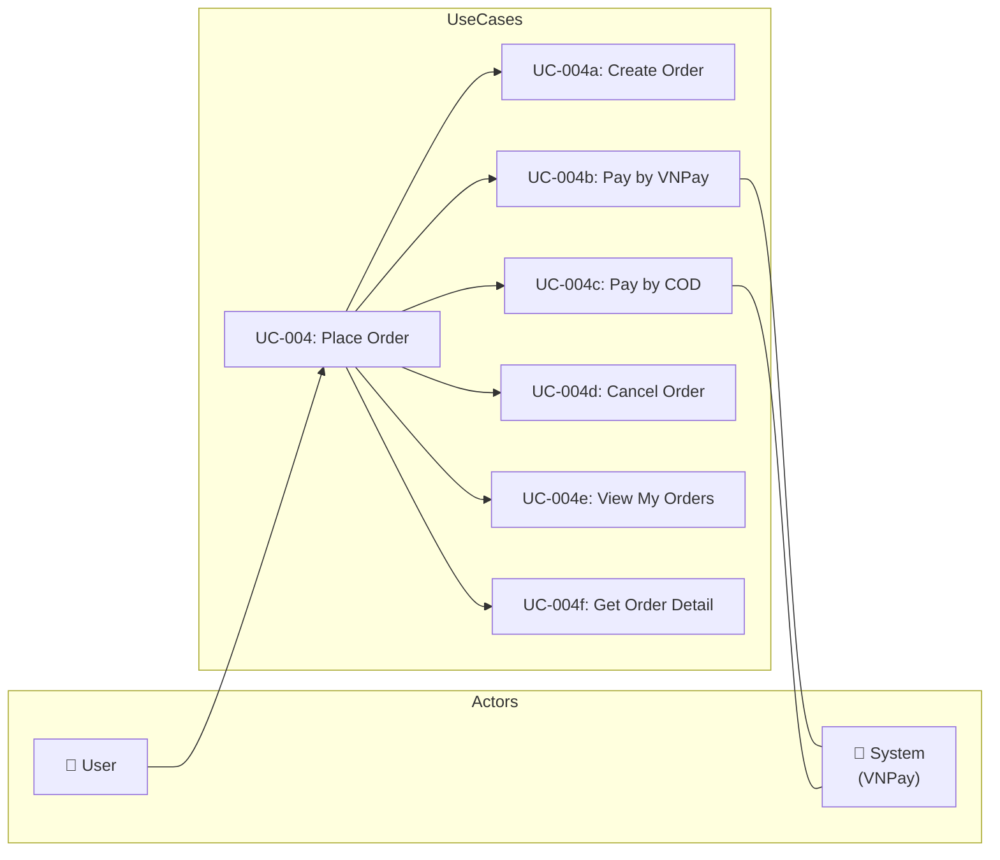
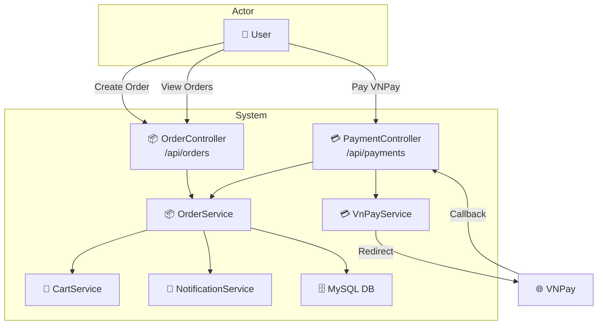
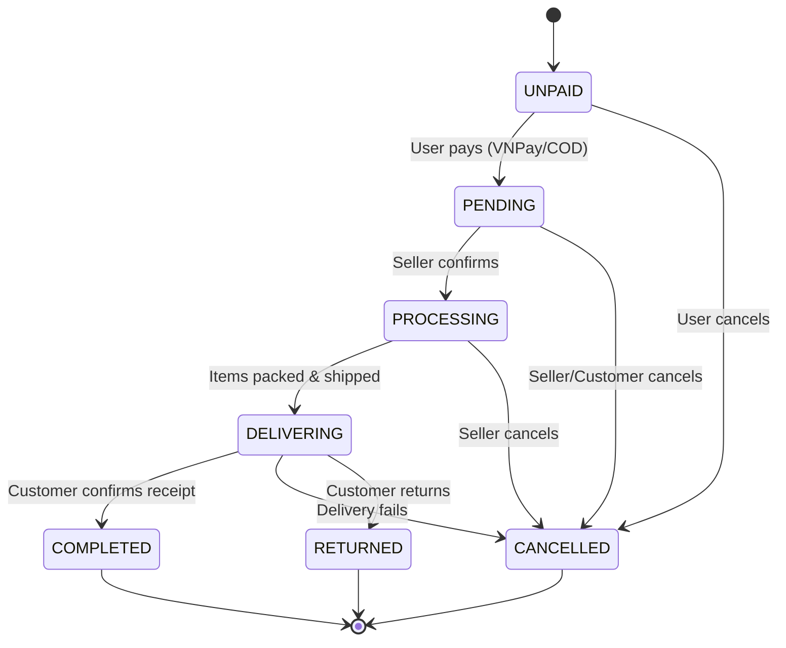

# UC-004: Place Order

> **Use Case ID:** UC-004
> **Phiên bản:** 1.0.0
> **Ngày:** 2026-04-25
> **Actor:** User
> **Priority:** Critical

---

## 1. Mô tả

Cho phép User đặt hàng với các phương thức thanh toán VNPay hoặc COD. Sau khi tạo đơn hàng, hệ thống hỗ trợ theo dõi trạng thái đơn hàng và xử lý thanh toán.

---

## 2. Use Case Diagram



---

## 3. Actor-System Interaction



---

## 4. Basic Flow

### 4.1 Create Order (Tạo đơn hàng)

| Step | Actor | System | Action |
|------|-------|--------|--------|
| 1 | User | | Gửi `POST /api/orders` với thông tin đơn hàng |
| 2 | | OrderController | Validate request |
| 3 | | OrderService | Tạo Order entity |
| 4 | | | Tạo OrderDetails từ request |
| 5 | | | Áp dụng Promotion nếu có |
| 6 | | | Trừ stock (từ Batch) |
| 7 | | | Trả về `OrderResponse` với status = UNPAID |
| 8 | User | | Nhận order, chọn phương thức thanh toán |

**API Endpoint:**
```
POST /api/orders
Body: { "addressId", "promotionCode", "paymentMethod" }
Auth: Cần đăng nhập
```

### 4.2 Pay by VNPay (Thanh toán VNPay)

| Step | Actor | System | Action |
|------|-------|--------|--------|
| 1 | User | | Gửi `POST /api/payments/vnpay/create/{orderId}` |
| 2 | | PaymentController | Gọi `vnPayService.createPaymentUrl()` |
| 3 | | VnPayService | Tạo VNPay payment URL |
| 4 | | | Trả về `paymentUrl` |
| 5 | User | | Redirect đến VNPay gateway |
| 6 | User | | Thanh toán trên VNPay |
| 7 | VNPay | | Redirect back về `/api/payments/vnpay/return` |
| 8 | | PaymentController | Gọi `vnPayService.processPaymentReturn()` |
| 9 | | VnPayService | Xác thực signature, kiểm tra kết quả |
| 10 | | OrderService | Cập nhật `paymentCode`, status → PENDING |
| 11 | | | Gửi notification cho user |
| 12 | User | | Nhận kết quả thanh toán |

**API Endpoints:**
```
POST /api/payments/vnpay/create/{orderId}
GET  /api/payments/vnpay/return
```

### 4.3 Pay by COD (Thanh toán khi nhận hàng)

| Step | Actor | System | Action |
|------|-------|--------|--------|
| 1 | User | | Gửi `PUT /api/orders/{orderId}/pay-cod` |
| 2 | | OrderController | Gọi `orderService.payByCOD()` |
| 3 | | OrderService | Cập nhật `paymentMethod = COD` |
| 4 | | | Đổi status → PENDING |
| 5 | | | Trả về updated OrderResponse |
| 6 | User | | Nhận xác nhận đơn hàng |

### 4.4 Cancel Order (Hủy đơn hàng)

| Step | Actor | System | Action |
|------|-------|--------|--------|
| 1 | User | | Gửi `PUT /api/orders/{orderId}/cancel` |
| 2 | | OrderController | Gọi `orderService.cancelOrderByCustomer()` |
| 3 | | OrderService | Kiểm tra order thuộc user |
| 4 | | | Kiểm tra status cho phép hủy (UNPAID, PENDING) |
| 5 | | | Hoàn lại stock vào Batch |
| 6 | | | Đổi status → CANCELLED |
| 7 | | | Trả về updated OrderResponse |
| 8 | User | | Nhận xác nhận hủy |

### 4.5 View My Orders (Xem đơn hàng của tôi)

| Step | Actor | System | Action |
|------|-------|--------|--------|
| 1 | User | | Gửi `GET /api/orders/my` |
| 2 | | OrderController | Extract user từ JWT, gọi `orderService.getMyOrders()` |
| 3 | | OrderService | Tìm tất cả orders của user |
| 4 | | | Trả về `List<OrderResponse>` |
| 5 | User | | Nhận danh sách đơn hàng |

### 4.6 Get Order Detail (Xem chi tiết đơn hàng)

| Step | Actor | System | Action |
|------|-------|--------|--------|
| 1 | User | | Gửi `GET /api/orders/{orderId}` |
| 2 | | OrderController | Gọi `orderService.getOrderById()` |
| 3 | | OrderService | Kiểm tra order thuộc user (hoặc admin) |
| 4 | | | Trả về `OrderResponse` với đầy đủ details |
| 5 | User | | Nhận chi tiết đơn hàng |

---

## 5. Alternative Flows

### 5.1 VNPay Payment Failed
- Khi VNPay trả về failed:
  - Giữ nguyên status = UNPAID
  - Trả về thông báo lỗi cho user
  - User có thể thử lại hoặc chọn COD

### 5.2 Cancel - Order Already Processing
- Khi cố hủy order đang ở trạng thái PROCESSING hoặc DELIVERING:
  - Trả về HTTP 400 "Cannot cancel order in current status"

### 5.3 Create Order - Out of Stock
- Khi không đủ stock để fulfill:
  - Trả về HTTP 400 "Insufficient stock"

### 5.4 Invalid Promotion Code
- Khi promotion code không hợp lệ:
  - Trả về HTTP 400 "Invalid promotion code"

---

## 6. Order Status Flow



---

## 7. Data Model

### CreateOrderRequest
```json
{
  "addressId": 1,
  "promotionCode": "SUMMER2026",
  "paymentMethod": "VNPAY"
}
```

### OrderResponse
```json
{
  "id": 1,
  "orderDate": "2026-04-25T10:30:00",
  "totalAmount": 475000.00,
  "status": "PENDING",
  "paymentCode": "VNPAY123456",
  "paymentMethod": "VNPAY",
  "user": { "id": 1, "name": "Nguyen Van A" },
  "deliveryAddress": { ... },
  "orderDetails": [
    {
      "id": 1,
      "bookId": 5,
      "bookTitle": "Clean Code",
      "quantity": 2,
      "priceAtPurchase": 250000.00
    }
  ],
  "promotion": { "code": "SUMMER2026", "discount": 10 }
}
```

---

## 8. Business Rules

| Rule | Description |
|------|-------------|
| BR-001 | Order chỉ được tạo khi user đã đăng nhập |
| BR-002 | Address phải thuộc về user đang đặt hàng |
| BR-003 | Stock được trừ từ Batch (FIFO: oldest batch first) |
| BR-004 | VNPay callback phải verify signature trước khi cập nhật |
| BR-005 | Chỉ UNPAID và PENDING orders mới được hủy |
| BR-006 | Promotion phải đang ACTIVE và chưa hết số lượng |

---

## 9. Preconditions

| Condition | Description |
|-----------|-------------|
| CP-001 | User phải đăng nhập |
| CP-002 | User phải có ít nhất 1 Address |
| CP-003 | VNPay credentials phải được cấu hình |

---

## 10. Postconditions

| Condition | Description |
|-----------|-------------|
| PS-001 | Order được tạo với status UNPAID |
| PS-002 | Stock được trừ khỏi Batch |
| PS-003 | PaymentCode được lưu sau khi thanh toán VNPay |

---

## 11. Related Documents

- **Sequence:** `sequence/seq-004.md`
- **State Machine:** `state/state-001-order.md`
- **Class Diagram:** `class-diagram/class-002-order.md`

---

## 12. Acceptance Criteria

| ID | Criteria | Test |
|----|----------|------|
| AC-001 | User có thể tạo đơn hàng | `POST /api/orders` → 201 |
| AC-002 | VNPay redirect hoạt động đúng | Nhận paymentUrl |
| AC-003 | VNPay callback cập nhật order đúng | Status → PENDING |
| AC-004 | COD payment hoạt động | `PUT /api/orders/{id}/pay-cod` → 200 |
| AC-005 | User có thể hủy đơn chưa xử lý | UNPAID → CANCELLED |
| AC-006 | User không thể hủy đơn đang giao | → 400 error |
| AC-007 | User có thể xem đơn hàng của mình | `GET /api/orders/my` → 200 |

---

*Generated by Senior BA Agent | BookStore Backend | 2026-04-25*
