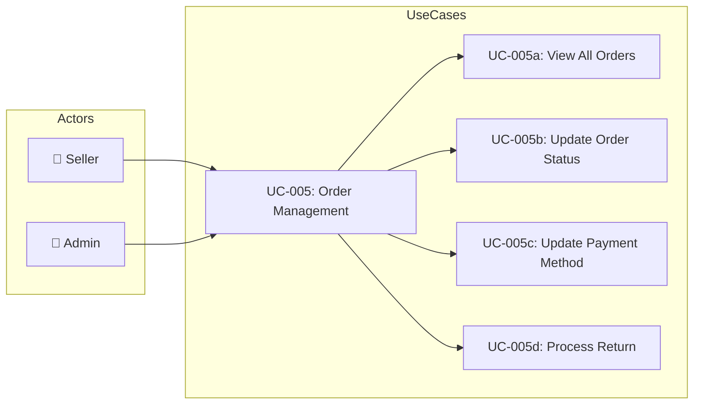
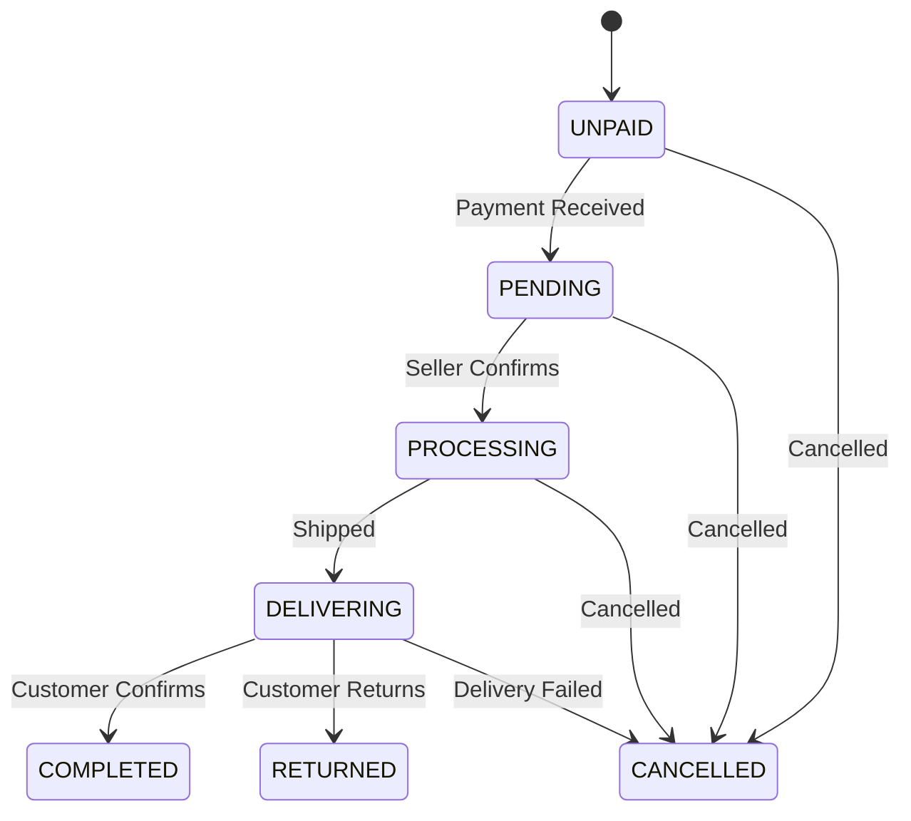

# UC-005: Order Management

> **Use Case ID:** UC-005
> **Phiên bản:** 1.0.0
> **Ngày:** 2026-04-25
> **Actor:** Seller, Admin
> **Priority:** High

---

## 1. Mô tả

Cho phép Seller và Admin quản lý đơn hàng: xác nhận đơn, cập nhật trạng thái (PROCESSING, DELIVERING), xác nhận giao hàng thành công, xem tất cả đơn hàng trong hệ thống.

---

## 2. Use Case Diagram

---

## 3. Basic Flow

### 3.1 View All Orders

| Step | Actor | System | Action |
|------|-------|--------|--------|
| 1 | Seller/Admin | | Gửi `GET /api/orders` |
| 2 | | OrderController | Gọi `orderService.getAllOrders()` |
| 3 | | OrderService | Trả về tất cả orders |
| 4 | Seller/Admin | | Nhận danh sách orders |

### 3.2 Update Order Status

| Step | Actor | System | Action |
|------|-------|--------|--------|
| 1 | Seller | | Gửi `PUT /api/orders/{orderId}/status` |
| 2 | | OrderController | Gọi `orderService.updateOrderStatus()` |
| 3 | | OrderService | Validate status transition |
| 4 | | | Cập nhật status |
| 5 | | | Gửi notification cho customer |
| 6 | | | Trả về updated OrderResponse |
| 7 | Seller | | Nhận xác nhận |

### 3.3 Confirm Delivery

| Step | Actor | System | Action |
|------|-------|--------|--------|
| 1 | User | | Gửi `PUT /api/orders/{orderId}/confirm-received` |
| 2 | | OrderController | Gọi `orderService.confirmReceivedByCustomer()` |
| 3 | | OrderService | Đổi status → COMPLETED |
| 4 | | | Trả về OrderResponse |
| 5 | User | | Nhận xác nhận |

### 3.4 Update Payment Method

| Step | Actor | System | Action |
|------|-------|--------|--------|
| 1 | Seller | | Gửi `PUT /api/orders/{orderId}/payment-method` |
| 2 | | OrderController | Gọi `orderService.updatePaymentMethod()` |
| 3 | | OrderService | Cập nhật paymentMethod |
| 4 | | | Trả về updated OrderResponse |
| 5 | Seller | | Nhận xác nhận |

---

## 4. Status Transitions

---

## 5. Business Rules

| Rule | Description |
|------|-------------|
| BR-001 | Seller chỉ có thể cập nhật orders thuộc cửa hàng |
| BR-002 | Admin có thể cập nhật mọi order |
| BR-003 | Status transition phải tuân theo flow |
| BR-004 | Notification được gửi khi status thay đổi |

---

## 6. Related Documents

- **Sequence:** `sequence/seq-005.md`
- **State Machine:** `state/state-001-order.md`

---

*Generated by Senior BA Agent | BookStore Backend | 2026-04-25*
