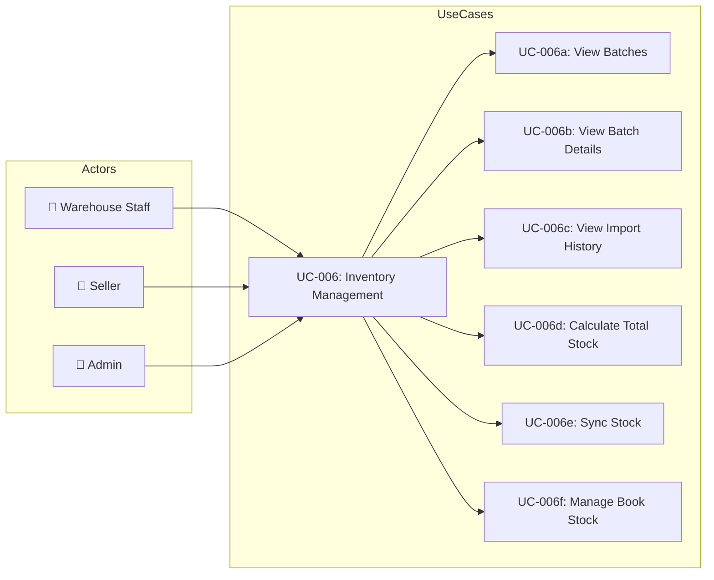
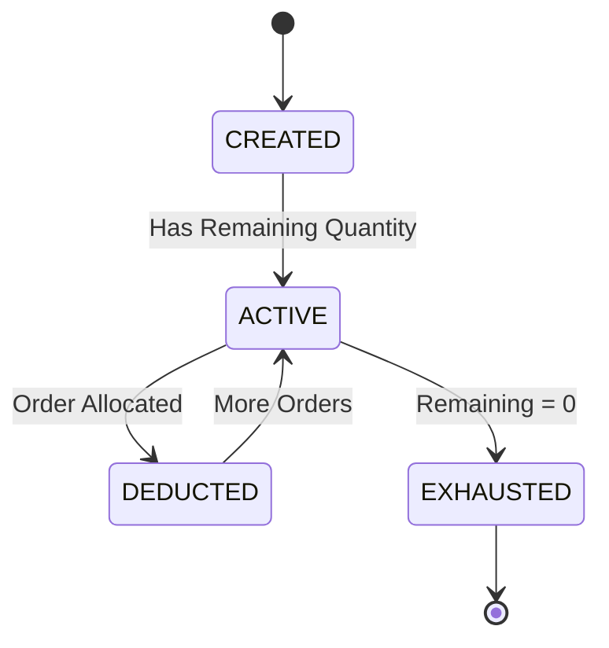

# UC-006: Inventory Management

> **Use Case ID:** UC-006
> **Phiên bản:** 1.0.0
> **Ngày:** 2026-04-25
> **Actor:** Warehouse Staff, Seller, Admin
> **Priority:** High

---

## 1. Mô tả

Quản lý tồn kho bao gồm xem batches, theo dõi lô hàng, xem lịch sử nhập kho, tính tổng stock theo sách, và đồng bộ stock quantity.

---

## 2. Use Case Diagram

---

## 3. Basic Flow

### 3.1 View All Batches

| Step | Actor | System | Action |
|------|-------|--------|--------|
| 1 | WS/Admin | | Gửi `GET /api/batches` |
| 2 | | BatchController | Gọi `batchService.getAllBatches()` |
| 3 | | | Trả về danh sách batches |
| 4 | Actor | | Nhận batches |

### 3.2 View Batches by Book

| Step | Actor | System | Action |
|------|-------|--------|--------|
| 1 | WS/Admin | | Gửi `GET /api/batches/book/{bookId}` |
| 2 | | BatchController | Gọi `batchService.getBatchesByBookId()` |
| 3 | | | Trả về batches của book |
| 4 | Actor | | Nhận danh sách |

### 3.3 Get Available Batches (FIFO)

| Step | Actor | System | Action |
|------|-------|--------|--------|
| 1 | WS/Admin | | Gửi `GET /api/batches/book/{bookId}/available` |
| 2 | | BatchController | Gọi `batchService.getAvailableBatches()` |
| 3 | | | Lọc batches có remainingQuantity > 0 |
| 4 | | | Sắp xếp theo createdAt (oldest first - FIFO) |
| 5 | | | Trả về available batches |
| 6 | Actor | | Nhận danh sách |

### 3.4 Calculate Total Stock

| Step | Actor | System | Action |
|------|-------|--------|--------|
| 1 | WS/Admin | | Gửi `GET /api/batches/book/{bookId}/total-stock` |
| 2 | | BatchController | Gọi `batchService.calculateTotalStock()` |
| 3 | | | Sum all `remainingQuantity` của book |
| 4 | | | Trả về tổng stock |
| 5 | Actor | | Nhận tổng số lượng |

### 3.5 Sync Stock to Book

| Step | Actor | System | Action |
|------|-------|--------|--------|
| 1 | WS/Admin | | Gửi `PUT /api/batches/book/{bookId}/sync-stock` |
| 2 | | BatchController | Gọi `batchService.syncStockToBook()` |
| 3 | | | Tính tổng remainingQuantity |
| 4 | | | Cập nhật `Book.stockQuantity` |
| 5 | | | Trả về số lượng đã sync |
| 6 | Actor | | Nhận xác nhận |

### 3.6 Create Batch (Manual)

| Step | Actor | System | Action |
|------|-------|--------|--------|
| 1 | WS/Admin | | Gửi `POST /api/batches` |
| 2 | | BatchController | Validate request |
| 3 | | BatchService | Tạo Batch entity |
| 4 | | | Tăng `Book.stockQuantity` |
| 5 | | | Trả về BatchResponse |
| 6 | Actor | | Nhận batch mới |

### 3.7 View Import History by Book

| Step | Actor | System | Action |
|------|-------|--------|--------|
| 1 | WS/Admin | | Gửi `GET /api/import-stocks/book/{bookId}` |
| 2 | | ImportStockController | Gọi `importStockService.getImportHistoryByBookId()` |
| 3 | | | Trả về danh sách import stocks |
| 4 | Actor | | Nhận lịch sử nhập kho |

---

## 4. Batch Lifecycle

---

## 5. Data Model

### Batch Fields
| Field | Type | Description |
|-------|------|-------------|
| id | Long | Primary key |
| batchCode | String | Unique batch identifier |
| quantity | int | Original quantity imported |
| remainingQuantity | int | Available quantity |
| importPrice | double | Cost price per unit |
| productionDate | LocalDate | Production/manufacturing date |
| createdAt | LocalDateTime | Import timestamp |

---

## 6. Business Rules

| Rule | Description |
|------|-------------|
| BR-001 | Batch tracking: production date, import price, supplier |
| BR-002 | FIFO: Batches sorted by createdAt for order fulfillment |
| BR-003 | remainingQuantity = quantity - sum(allocation) |
| BR-004 | Sync đảm bảo Book.stockQuantity = sum(Batch.remainingQuantity) |

---

## 7. Related Documents

- **Sequence:** `sequence/seq-010.md`
- **Class Diagram:** `class-diagram/class-004-inventory.md`

---

*Generated by Senior BA Agent | BookStore Backend | 2026-04-25*
