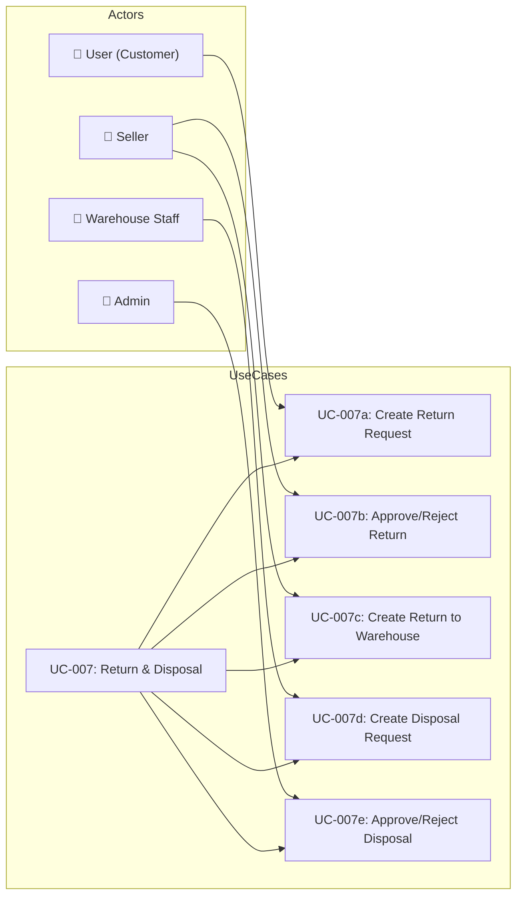
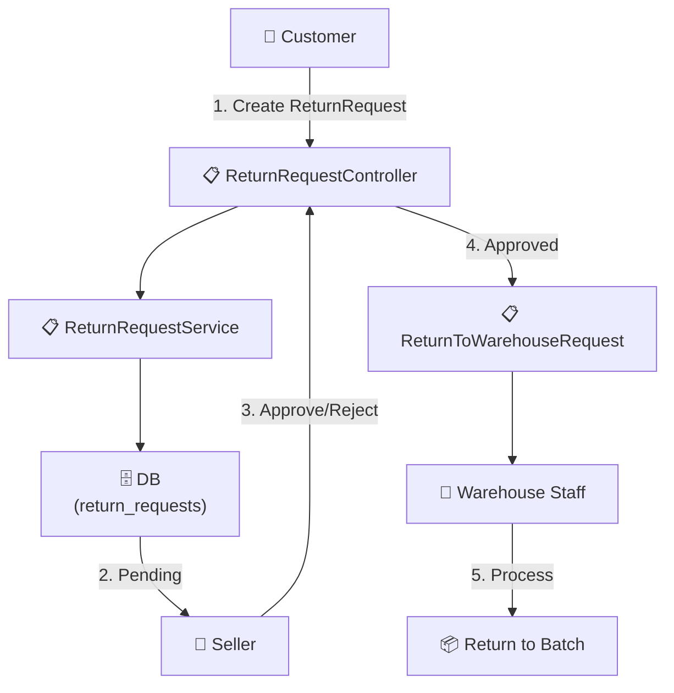
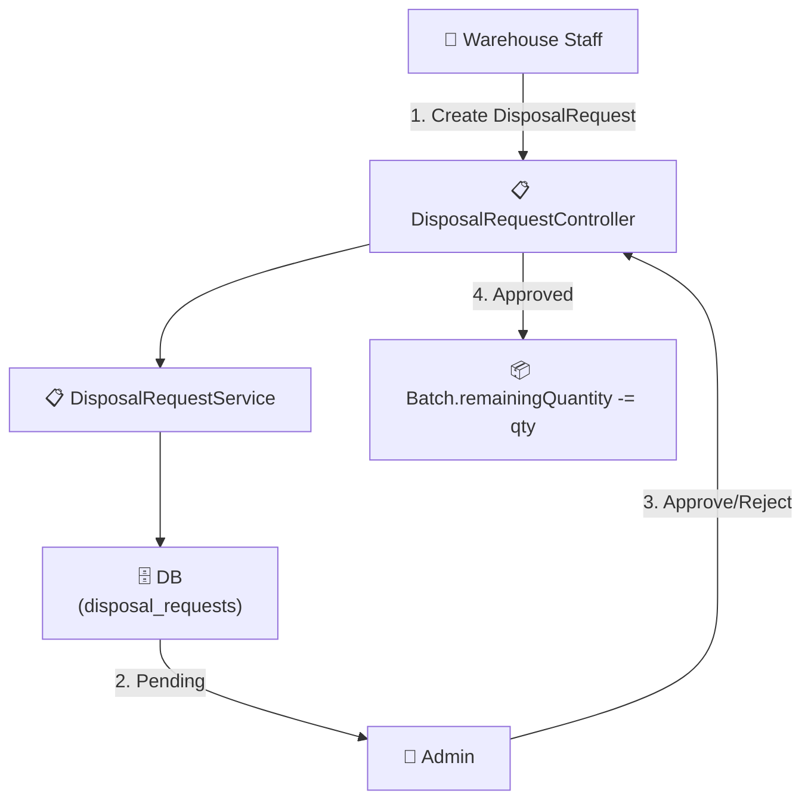

# UC-007: Return & Disposal

> **Use Case ID:** UC-007
> **Phiên bản:** 1.0.0
> **Ngày:** 2026-04-25
> **Actor:** User, Seller, Warehouse Staff, Admin
> **Priority:** Medium

---

## 1. Mô tả

Xử lý các yêu cầu trả hàng của khách, thanh lý hàng hóa hỏng, và quản lý hàng trả lại về kho từ seller.

---

## 2. Use Case Diagram



---

## 3. Return Request Flow



---

## 4. Disposal Flow



---

## 5. Basic Flow - Return Request

### 5.1 Create Return Request

| Step | Actor | System | Action |
|------|-------|--------|--------|
| 1 | User | | Gửi `POST /api/return-requests` |
| 2 | | ReturnRequestController | Gọi `returnRequestService.createReturnRequest()` |
| 3 | | ReturnRequestService | Tạo ReturnRequest (status = PENDING) |
| 4 | | | Trả về `ReturnRequestResponse` |
| 5 | User | | Nhận xác nhận đã tạo yêu cầu |

### 5.2 Approve Return Request

| Step | Actor | System | Action |
|------|-------|--------|--------|
| 1 | Seller | | Gửi `PUT /api/return-requests/{id}/approve` |
| 2 | | ReturnRequestController | Gọi `returnRequestService.approveReturnRequest()` |
| 3 | | ReturnRequestService | Đổi status → APPROVED |
| 4 | | | Trả về updated response |
| 5 | Seller | | Nhận xác nhận |

### 5.3 Reject Return Request

| Step | Actor | System | Action |
|------|-------|--------|--------|
| 1 | Seller | | Gửi `PUT /api/return-requests/{id}/reject` |
| 2 | | ReturnRequestController | Gọi `returnRequestService.rejectReturnRequest()` |
| 3 | | ReturnRequestService | Đổi status → REJECTED |
| 4 | | | Trả về updated response |
| 5 | Seller | | Nhận thông báo từ chối |

### 5.4 Create Return to Warehouse

| Step | Actor | System | Action |
|------|-------|--------|--------|
| 1 | Seller | | Gửi `POST /api/return-to-warehouse-requests` |
| 2 | | ReturnToWarehouseController | Tạo request |
| 3 | | Service | Đổi status → APPROVED/REJECTED |
| 4 | | | Cập nhật Batch.remainingQuantity |
| 5 | Seller | | Nhận xác nhận |

---

## 6. Basic Flow - Disposal

### 6.1 Create Disposal Request

| Step | Actor | System | Action |
|------|-------|--------|--------|
| 1 | Warehouse Staff | | Gửi `POST /api/disposal-requests` |
| 2 | | DisposalRequestController | Tạo DisposalRequest với items |
| 3 | | DisposalRequestService | Tạo DisposalRequestItems (link đến Batch) |
| 4 | | | Trả về response |
| 5 | WS | | Nhận xác nhận |

### 6.2 Approve Disposal

| Step | Actor | System | Action |
|------|-------|--------|--------|
| 1 | Admin | | Gửi `PUT /api/disposal-requests/{id}/approve` |
| 2 | | DisposalRequestController | Gọi `disposalRequestService.approve()` |
| 3 | | DisposalRequestService | Duyệt request |
| 4 | | | Trừ Batch.remainingQuantity cho mỗi item |
| 5 | | | Trả về updated response |
| 6 | Admin | | Nhận xác nhận |

### 6.3 Reject Disposal

| Step | Actor | System | Action |
|------|-------|--------|--------|
| 1 | Admin | | Gửi `PUT /api/disposal-requests/{id}/reject` |
| 2 | | DisposalRequestController | Gọi `disposalRequestService.reject()` |
| 3 | | | Đổi status → REJECTED |
| 4 | | | Trả về response |
| 5 | Admin | | Nhận thông báo |

---

## 7. Status Flows

### ReturnRequest
```
PENDING → APPROVED → (ReturnToWarehouse)
PENDING → REJECTED
```

### DisposalRequest
```
PENDING → APPROVED → (Batch stock decremented)
PENDING → REJECTED
```

### ReturnToWarehouseRequest
```
PENDING → APPROVED → (Stock returned to batch)
PENDING → REJECTED
```

---

## 8. Business Rules

| Rule | Description |
|------|-------------|
| BR-001 | DisposalRequestItem link đến Batch để track số lượng thanh lý |
| BR-002 | Sau khi approve disposal: `Batch.remainingQuantity -= item.quantity` |
| BR-003 | ReturnRequest chỉ áp dụng cho COMPLETED orders |
| BR-004 | Approval/Rejection có audit: processedAt, processedBy |

---

## 9. Related Documents

- **Sequence:** `sequence/seq-007.md`, `sequence/seq-008.md`
- **Class Diagram:** `class-diagram/class-006-returns.md`

---

*Generated by Senior BA Agent | BookStore Backend | 2026-04-25*
