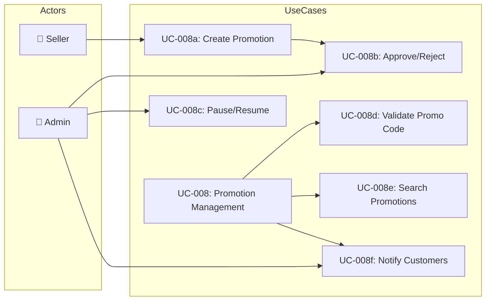
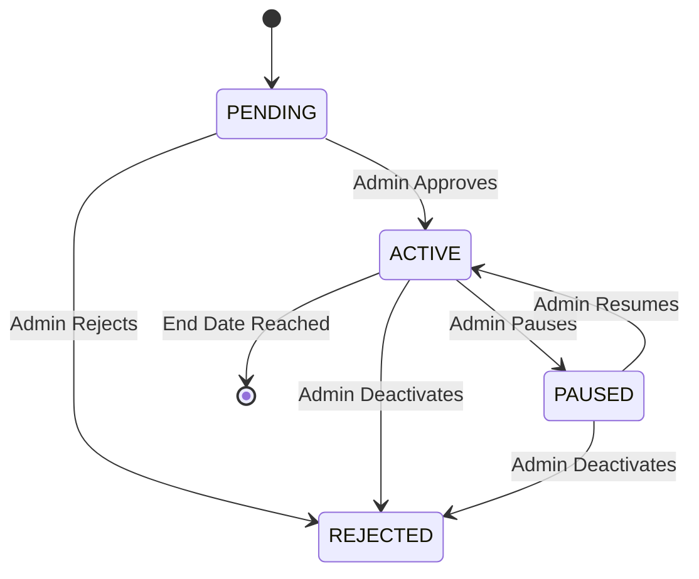

# UC-008: Promotion Management

> **Use Case ID:** UC-008
> **Phiên bản:** 1.0.0
> **Ngày:** 2026-04-25
> **Actor:** Seller, Admin
> **Priority:** Medium

---

## 1. Mô tả

Quản lý khuyến mãi: tạo mã giảm giá, duyệt, tạm dừng, tiếp tục, và gửi thông báo cho khách hàng.

---

## 2. Use Case Diagram

---

## 3. Basic Flow

### 3.1 Create Promotion

| Step | Actor | System | Action |
|------|-------|--------|--------|
| 1 | Seller | | Gửi `POST /api/promotions` |
| 2 | | PromotionController | Gọi `promotionService.createPromotion()` |
| 3 | | PromotionService | Tạo Promotion (status = PENDING) |
| 4 | | | Trả về `PromotionResponse` |
| 5 | Seller | | Chờ duyệt |

### 3.2 Approve Promotion

| Step | Actor | System | Action |
|------|-------|--------|--------|
| 1 | Admin | | Gửi `PATCH /api/promotions/{id}/approve` |
| 2 | | PromotionController | Gọi `promotionService.approvePromotion()` |
| 3 | | | Đổi status → ACTIVE |
| 4 | | | Trả về response |
| 5 | Admin | | Nhận xác nhận |

### 3.3 Pause Promotion

| Step | Actor | System | Action |
|------|-------|--------|--------|
| 1 | Admin | | Gửi `PATCH /api/promotions/{id}/pause` |
| 2 | | PromotionController | Gọi `promotionService.pausePromotion()` |
| 3 | | | Đổi status → PAUSED |
| 4 | | | Gửi notification cho users |
| 5 | | | Trả về response |
| 6 | Admin | | Nhận xác nhận |

### 3.4 Resume Promotion

| Step | Actor | System | Action |
|------|-------|--------|--------|
| 1 | Admin | | Gửi `PATCH /api/promotions/{id}/resume` |
| 2 | | PromotionController | Gọi `promotionService.resumePromotion()` |
| 3 | | | Đổi status → ACTIVE |
| 4 | | | Gửi notification |
| 5 | | | Trả về response |
| 6 | Admin | | Nhận xác nhận |

### 3.5 Validate Promo Code

| Step | Actor | System | Action |
|------|-------|--------|--------|
| 1 | User | | Gửi `GET /api/promotions/validate/{code}` |
| 2 | | PromotionController | Gọi `promotionService.validatePromotionCode()` |
| 3 | | | Kiểm tra code tồn tại, ACTIVE, còn số lượng |
| 4 | | | Trả về `{ "isValid": true/false }` |
| 5 | User | | Nhận kết quả |

---

## 4. Status Flow

---

## 5. Data Model

### Promotion Fields
| Field | Type | Description |
|-------|------|-------------|
| id | Long | Primary key |
| name | String | Tên khuyến mãi |
| code | String | Mã giảm giá (unique) |
| discountPercent | double | % giảm giá |
| startDate | LocalDate | Ngày bắt đầu |
| endDate | LocalDate | Ngày kết thúc |
| quantity | int | Số lượng mã |
| status | PromotionStatus | PENDING/ACTIVE/REJECTED/PAUSED |
| priceOrderActive | double | Đơn hàng tối thiểu |
| createdBy | User | Người tạo |
| approvedBy | User | Người duyệt |

---

## 6. Business Rules

| Rule | Description |
|------|-------------|
| BR-001 | Chỉ ACTIVE promotions mới có thể sử dụng |
| BR-002 | Số lượng promotion giới hạn (countdown) |
| BR-003 | Notification được gửi khi pause/resume |
| BR-004 | Admin có thể deactivate bất kỳ lúc nào |

---

## 7. Related Documents

- **Sequence:** `sequence/seq-009.md`
- **State Machine:** `state/state-004-promotion.md`

---

*Generated by Senior BA Agent | BookStore Backend | 2026-04-25*
