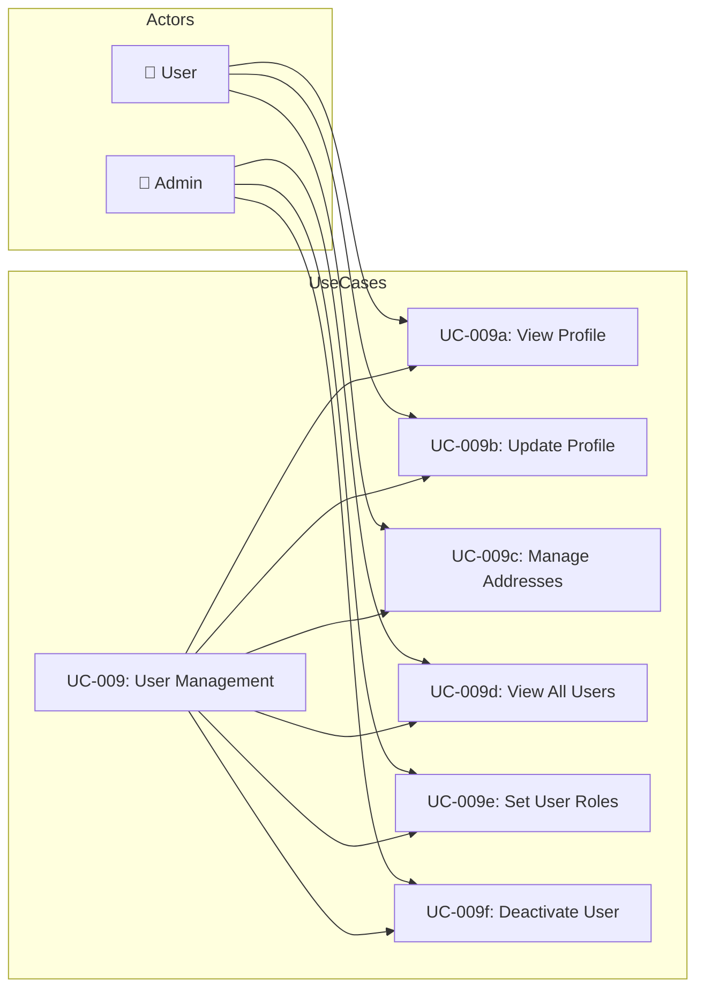

# UC-009: User Management

> **Use Case ID:** UC-009
> **Phiên bản:** 1.0.0
> **Ngày:** 2026-04-25
> **Actor:** User, Admin
> **Priority:** High

---

## 1. Mô tả

Quản lý tài khoản người dùng: xem profile, cập nhật thông tin, quản lý địa chỉ giao hàng, và quản lý vai trò (Admin).

---

## 2. Use Case Diagram

---

## 3. Basic Flow - User Profile

### 3.1 View My Profile

| Step | Actor | System | Action |
|------|-------|--------|--------|
| 1 | User | | Gửi `GET /api/users/me` |
| 2 | | UserController | Extract user từ JWT, gọi service |
| 3 | | UserService | Trả về UserResponse |
| 4 | User | | Nhận profile |

### 3.2 Update Profile

| Step | Actor | System | Action |
|------|-------|--------|--------|
| 1 | User | | Gửi `PUT /api/users/{id}` |
| 2 | | UserController | Validate request |
| 3 | | UserService | Cập nhật thông tin |
| 4 | | | Trả về updated UserResponse |
| 5 | User | | Nhận xác nhận |

### 3.3 Manage Addresses

| Step | Actor | System | Action |
|------|-------|--------|--------|
| 1 | User | | `GET /api/users/{userId}/addresses` - Xem addresses |
| 2 | | | `POST /api/users/{userId}/addresses` - Thêm address |
| 3 | | | `PUT /api/users/{userId}/addresses/{id}` - Cập nhật |
| 4 | | | `DELETE /api/users/{userId}/addresses/{id}` - Xóa |
| 5 | | | `PUT /api/users/{userId}/addresses/{id}/default` - Set default |

---

## 4. Basic Flow - Admin

### 4.1 View All Users

| Step | Actor | System | Action |
|------|-------|--------|--------|
| 1 | Admin | | Gửi `GET /api/users` |
| 2 | | UserController | Gọi `userService.getAllUsers()` |
| 3 | | | Trả về `List<UserResponse>` |
| 4 | Admin | | Nhận danh sách |

### 4.2 Set User Roles

| Step | Actor | System | Action |
|------|-------|--------|--------|
| 1 | Admin | | Gửi `PATCH /api/users/{id}/roles/codes` |
| 2 | | UserController | Body: `{ "roleCodes": ["USER", "SELLER"] }` |
| 3 | | UserService | Cập nhật roles |
| 4 | | | Trả về updated UserResponse |
| 5 | Admin | | Nhận xác nhận |

### 4.3 Deactivate User

| Step | Actor | System | Action |
|------|-------|--------|--------|
| 1 | Admin | | Gửi `PATCH /api/users/{id}/active` |
| 2 | | UserController | Body: `{ "isActive": false }` |
| 3 | | UserService | Đặt `isActive = false` |
| 4 | | | Trả về response |
| 5 | Admin | | User bị deactivate |

---

## 5. User Entity

### Fields
| Field | Type | Description |
|-------|------|-------------|
| id | Long | Primary key |
| firstName | String | Họ |
| lastName | String | Tên |
| gender | Gender | MALE/FEMALE/OTHER |
| email | String | Email (unique) |
| phoneNumber | String | Số điện thoại |
| isActive | boolean | Trạng thái hoạt động |
| password | String | Hashed password |
| roles | Set<Role> | Các vai trò |

---

## 6. Roles

| Role Code | Description |
|-----------|-------------|
| ADMIN | Quản trị viên |
| USER | Khách hàng thường |
| SELLER | Nhân viên bán hàng |
| WAREHOUSE_STAFF | Nhân viên kho |
| GUEST | Khách (chưa đăng nhập) |

---

## 7. Related Documents

- **Class Diagram:** `class-diagram/class-003-user.md`

---

*Generated by Senior BA Agent | BookStore Backend | 2026-04-25*
