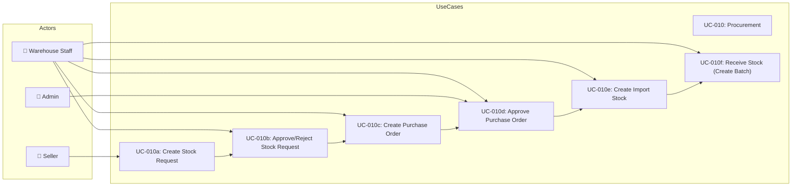
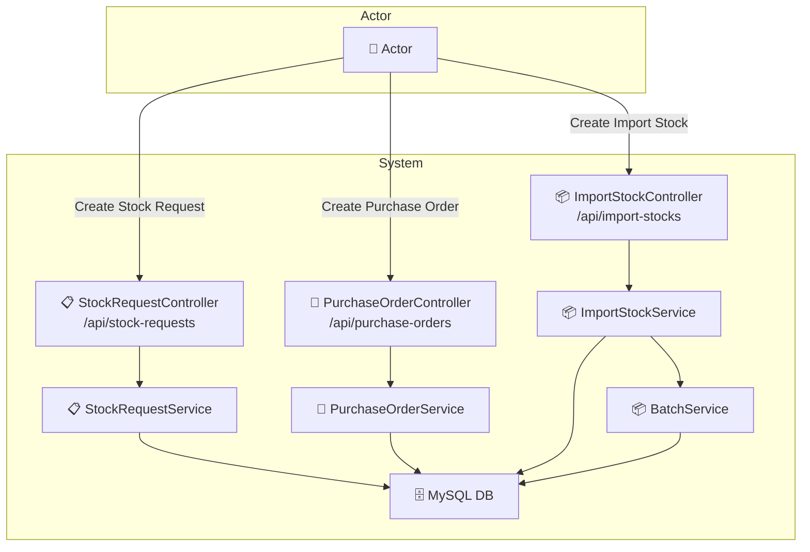
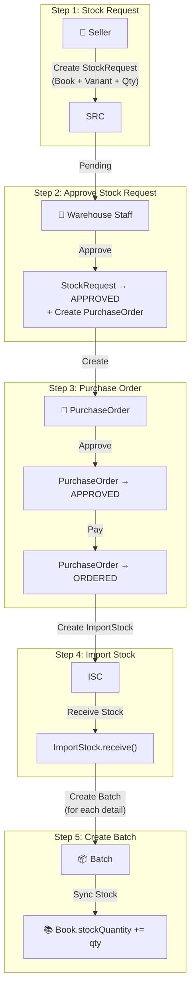
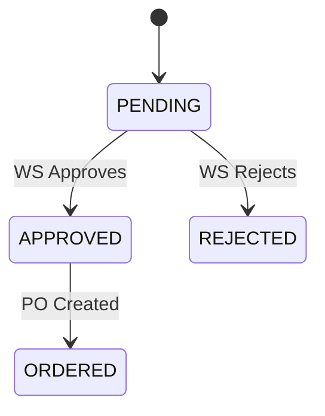
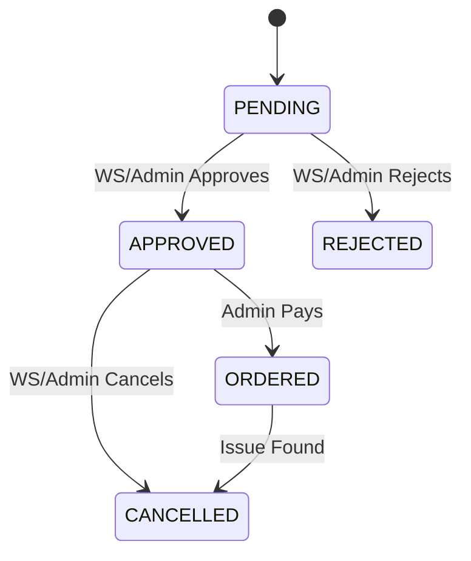

# UC-010: Procurement

> **Use Case ID:** UC-010
> **Phiên bản:** 1.0.0
> **Ngày:** 2026-04-25
> **Actor:** Seller, Warehouse Staff, Admin
> **Priority:** High

---

## 1. Mô tả

Quy trình mua hàng từ nhà cung cấp: tạo yêu cầu nhập hàng (StockRequest), tạo đơn đặt hàng (PurchaseOrder), nhập kho (ImportStock), và tạo lô hàng (Batch).

---

## 2. Use Case Diagram

---

## 3. Actor-System Interaction

---

## 4. Full Procurement Flow

---

## 5. Basic Flow - Stock Request

### 5.1 Create Stock Request

| Step | Actor | System | Action |
|------|-------|--------|--------|
| 1 | Seller | | Gửi `POST /api/stock-requests` |
| 2 | | StockRequestController | Gọi `stockRequestService.createStockRequest()` |
| 3 | | StockRequestService | Tạo StockRequest (status = PENDING) |
| 4 | | | Trả về `StockRequestResponse` |
| 5 | Seller | | Nhận xác nhận đã tạo yêu cầu |

### 5.2 View My Stock Requests

| Step | Actor | System | Action |
|------|-------|--------|--------|
| 1 | Seller | | Gửi `GET /api/stock-requests/my-requests?userId={id}` |
| 2 | | StockRequestController | Gọi service |
| 3 | | | Trả về danh sách requests |
| 4 | Seller | | Nhận danh sách |

### 5.3 Approve Stock Request

| Step | Actor | System | Action |
|------|-------|--------|--------|
| 1 | Warehouse Staff | | Gửi `PUT /api/stock-requests/{id}/approve` |
| 2 | | StockRequestController | Gọi `stockRequestService.approveStockRequest()` |
| 3 | | StockRequestService | Đổi status → APPROVED |
| 4 | | | Tạo PurchaseOrder từ StockRequest (optional) |
| 5 | | | Trả về response |
| 6 | WS | | Nhận xác nhận |

### 5.4 Reject Stock Request

| Step | Actor | System | Action |
|------|-------|--------|--------|
| 1 | Warehouse Staff | | Gửi `PUT /api/stock-requests/{id}/reject` |
| 2 | | StockRequestController | Gọi `stockRequestService.rejectStockRequest()` |
| 3 | | StockRequestService | Đổi status → REJECTED |
| 4 | | | Trả về response |
| 5 | WS | | Nhận thông báo |

---

## 6. Basic Flow - Purchase Order

### 6.1 Create Purchase Order

| Step | Actor | System | Action |
|------|-------|--------|--------|
| 1 | WS | | Gửi `POST /api/purchase-orders` |
| 2 | | PurchaseOrderController | Gọi service |
| 3 | | PurchaseOrderService | Tạo PurchaseOrder + Items |
| 4 | | | Trả về response |
| 5 | WS | | Nhận PurchaseOrder |

### 6.2 Create from Stock Request

| Step | Actor | System | Action |
|------|-------|--------|--------|
| 1 | WS | | Gửi `POST /api/purchase-orders/from-stock-request` |
| 2 | | PurchaseOrderController | Body: `{ stockRequestId, supplierId }` |
| 3 | | PurchaseOrderService | Tạo PO từ StockRequest đã approve |
| 4 | | | Trả về PurchaseOrderResponse |
| 5 | WS | | Nhận PurchaseOrder |

### 6.3 Approve Purchase Order

| Step | Actor | System | Action |
|------|-------|--------|--------|
| 1 | WS/Admin | | Gửi `PUT /api/purchase-orders/{id}/approve` |
| 2 | | PurchaseOrderController | Gọi service |
| 3 | | PurchaseOrderService | Đổi status → APPROVED |
| 4 | | | Trả về response |
| 5 | Actor | | Nhận xác nhận |

### 6.4 Pay Purchase Order

| Step | Actor | System | Action |
|------|-------|--------|--------|
| 1 | Admin | | Gửi `POST /api/purchase-orders/{id}/pay` |
| 2 | | PurchaseOrderController | Gọi service |
| 3 | | PurchaseOrderService | Đổi status → ORDERED |
| 4 | | | Trả về response |
| 5 | Admin | | Đơn hàng với supplier đã được thanh toán |

### 6.5 Cancel Purchase Order

| Step | Actor | System | Action |
|------|-------|--------|--------|
| 1 | WS/Admin | | Gửi `PUT /api/purchase-orders/{id}/cancel` |
| 2 | | PurchaseOrderController | Body: `{ cancelReason }` |
| 3 | | PurchaseOrderService | Đổi status → CANCELLED |
| 4 | | | Trả về response |
| 5 | Actor | | Nhận xác nhận |

---

## 7. Basic Flow - Import Stock

### 7.1 Create Import Stock

| Step | Actor | System | Action |
|------|-------|--------|--------|
| 1 | WS | | Gửi `POST /api/import-stocks` |
| 2 | | ImportStockController | Gọi `importStockService.createImportStock()` |
| 3 | | ImportStockService | Tạo ImportStock + Details |
| 4 | | | Trả về response |
| 5 | WS | | Nhận ImportStock |

### 7.2 Receive Stock (Create Batch)

| Step | Actor | System | Action |
|------|-------|--------|--------|
| 1 | WS | | Gửi `POST /api/import-stocks/{id}/receive?userId={id}` |
| 2 | | ImportStockController | Gọi `importStockService.receiveStock()` |
| 3 | | ImportStockService | Đánh dấu `received = true` |
| 4 | | | Tạo Batch cho mỗi ImportStockDetail |
| 5 | | | Gọi BatchService.syncStockToBook() |
| 6 | | | Trả về `ReceiveStockResponse` |
| 7 | WS | | Nhận batches đã tạo |

---

## 8. Stock Request Status Flow

---

## 9. Purchase Order Status Flow

---

## 10. Business Rules

| Rule | Description |
|------|-------------|
| BR-001 | StockRequest → PurchaseOrder: Nhiều SR có thể tạo 1 PO |
| BR-002 | PurchaseOrder → ImportStock: 1 PO có thể tạo nhiều ImportStock |
| BR-003 | ImportStockDetail → Batch: 1 detail tạo 1 batch |
| BR-004 | Batch link đến Supplier, Variant, Book, ImportStockDetail |
| BR-005 | Sau khi receive: `Book.stockQuantity` được sync |

---

## 11. Related Documents

- **Sequence:** `sequence/seq-006.md`, `sequence/seq-010.md`
- **Class Diagram:** `class-diagram/class-004-inventory.md`, `class-diagram/class-005-requests.md`

---

## 12. Acceptance Criteria

| ID | Criteria | Test |
|----|----------|------|
| AC-001 | Seller có thể tạo StockRequest | `POST /api/stock-requests` → 201 |
| AC-002 | WS có thể approve/reject StockRequest | → status updated |
| AC-003 | PurchaseOrder được tạo từ StockRequest | → PO with items |
| AC-004 | ImportStock được tạo sau khi PO ordered | → ImportStock created |
| AC-005 | Batch được tạo khi receive stock | → Batch created |
| AC-006 | Book.stockQuantity được sync | → stock updated |

---

*Generated by Senior BA Agent | BookStore Backend | 2026-04-25*
